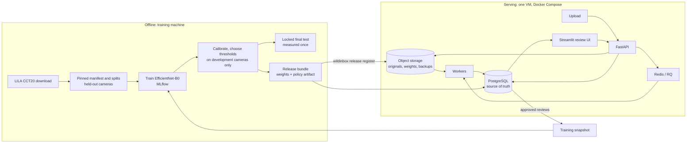
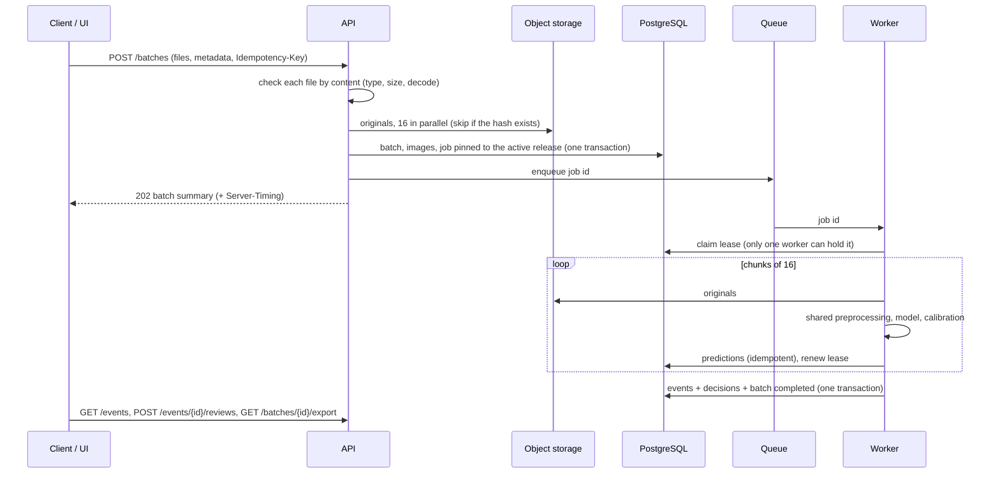

# Architecture

WildInbox has two halves that meet at one artifact, the **release**. The
serving system takes photo batches, groups them into capture events, and
decides which need a person. The offline ML pipeline produces the model and
the evidence behind every threshold. A release (weights, taxonomy,
preprocessing, calibration, decision policy) is built offline, registered
once, and pinned to every job that uses it.

## Serving components

| Component | Responsibility | Code |
|---|---|---|
| API (FastAPI) | Validates uploads, stores originals, creates the batch and its job, serves events, reviews, exports, releases, monitoring. Bearer-token access; readiness | `api/` |
| Queue (Redis, RQ) | Carries job ids only. Losing a message loses nothing: the job row stays queued and is redispatched | `workers/dispatch.py` |
| Workers | Claim a job under a lease, score images in chunks of 16, group events, decide, finalize in one transaction | `workers/process.py` |
| PostgreSQL | Batches, images, jobs, predictions, events, decisions, reviews, releases, activations, worker liveness | `storage/models.py`, `migrations/` |
| Object storage | Originals (content-addressed by SHA-256), thumbnails, release weights; S3 on staging, SeaweedFS locally | `storage/objects.py` |
| Review UI (Streamlit) | Review queue, timeline, last night's visitors, filtered and audit views, export, monitoring. Talks only to the API | `ui/` |

## A batch, end to end

- **Grouping:** supplied sequence ids, otherwise the camera plus capture-time
  gaps (an editable rule). Events are written only when the whole batch is
  scored, never from a partial one.
- **Decisions** come from the release's versioned policy
  (`policy/conservative.py`), which gives likely empty, species identified, or
  needs review, with machine-readable reasons. An event is filtered only when
  every usable frame supports empty. Any animal frame keeps it. Conflicting
  species go to review. A fixed 5% of automatic decisions is sampled for
  audit (`policy/audit.py`).
- **Reviews** are appended and never overwrite the model's suggestion.
  Exports carry the release, calibration, and policy versions behind each
  row.

## Versioning and reproducibility

| What | How it is pinned |
|---|---|
| Dataset | Inventory manifest and split lock with hashes (`manifests/`); sequences never cross splits; held-out cameras |
| Preprocessing | One module for training, evaluation, and serving (`preprocessing.py`); its settings fingerprint is recorded with every prediction |
| Model | Weights by SHA-256, checked when a worker or `/ready` loads them |
| Calibration, thresholds, policy | A policy artifact tied to the weights' digest; registration refuses a mismatch |
| Release | Immutable id `model@artifact`; each job keeps the release it was created with; activation is append-only (`GET /releases`) |
| Evidence | Pre-registered protocols in `configs/experiments/`; every report is saved in `reports/` with its code commit |

## Reliability

- **Idempotent writes:** uploads are deduplicated by `Idempotency-Key` or
  content. Predictions are unique per image and release. Events and
  decisions are written in the transaction that completes the job, so a
  retry cannot duplicate them.
- **Leases and recovery:** a worker renews its lease with every chunk. A
  lease that expires (120 s) is recovered by any worker's sweep. The retry
  keeps the saved predictions and scores the rest. Failed attempts back off
  exponentially up to `max_attempts`, then fail with the error on the batch.
- **Explicit failures:** every unusable file gets a recorded reason, and the
  rest of the batch proceeds.
- **Readiness:** `/ready` fails unless the database, queue, and object store
  answer and the expected release is active with its weights loaded. Workers
  load that release before taking jobs.

Evidence: `reports/serving/` (SIGKILL mid-batch), `reports/staging/` (restart,
invalid files, concurrent batches, backup and restore).

## Offline ML pipeline

1. `wildinbox data acquire`, `dataset build`: download, validate, inventory,
   and build pinned splits with a leakage report ([dataset.md](dataset.md)).
2. `baseline train`, `finetune train`: the frozen-embedding baseline and the
   EfficientNet-B0 fine-tunes, logged to MLflow.
3. `evaluate`, `compare`: development partitions only; a pre-registered rule
   selects the model.
4. `unfamiliar`, `calibrate`: the unfamiliar-input score (evaluated, not
   adopted); temperature scaling and thresholds from development cameras. The
   result is the policy artifact.
5. `final-test`: the locked unseen cameras, measured once under a protocol
   committed beforehand. `final-evaluation` adds the capstone metrics to the
   same frozen test ([report](../reports/final_evaluation/README.md)).
6. `snapshot build`, `update gate`: corrections become a versioned snapshot;
   a candidate is promoted only through a pre-registered gate on
   development data ([retraining.md](retraining.md)).

## Deployment

- **Local:** `docker compose up -d --build --wait` runs Postgres, Redis,
  SeaweedFS, migrations, API, worker, and UI with access tokens disabled.
- **Staging:** one AWS VM from a CloudFormation template, with S3 through the
  instance role, tokens required, JSON logs, SSH-only access, and nightly
  database backups ([deployment.md](deployment.md)).
- **Scaling:** more workers help when batches overlap. One batch is one job
  on one worker ([staging report](../reports/staging/README.md#adding-a-second-worker)).

## Monitoring

`/monitoring` and `/metrics` report operations (queue age, failures,
latency, workers, storage, cost per batch) and model behavior (decision
shares, label and confidence mixes per camera, audited errors). Label-free
signals and audited accuracy are kept apart: a camera without audit labels
shows unknown accuracy ([monitoring.md](monitoring.md)).
