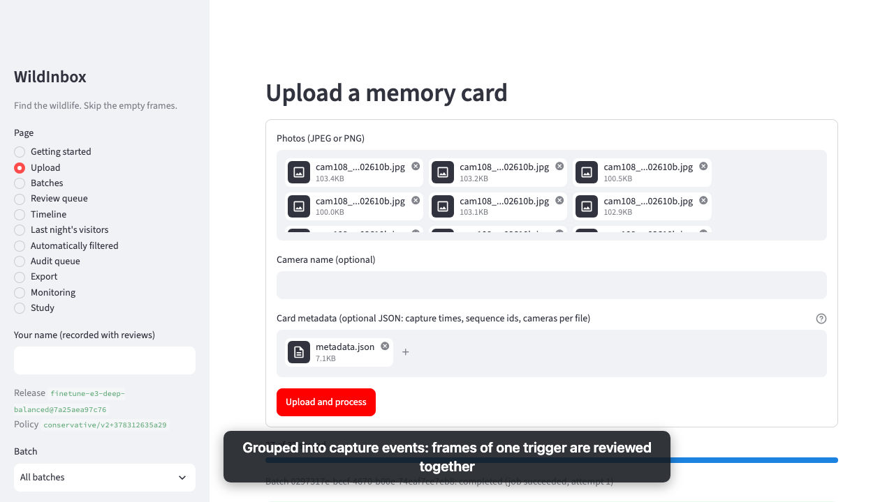
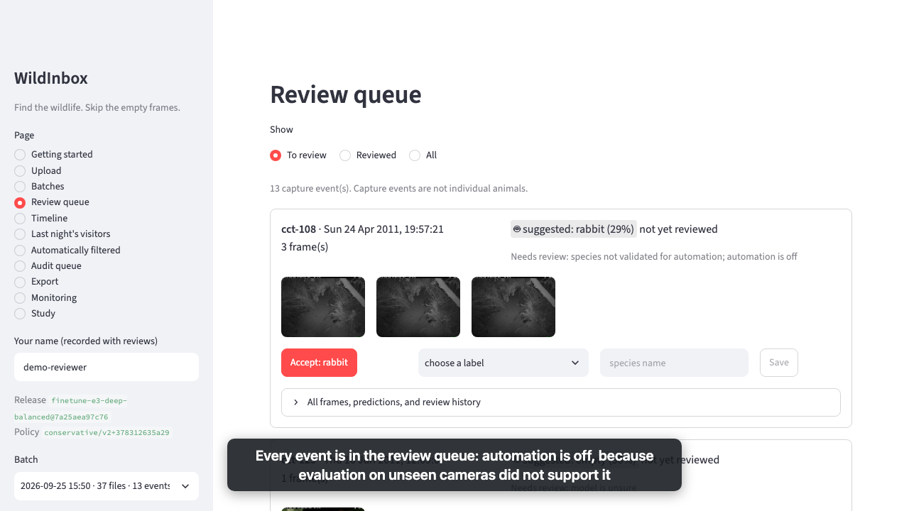
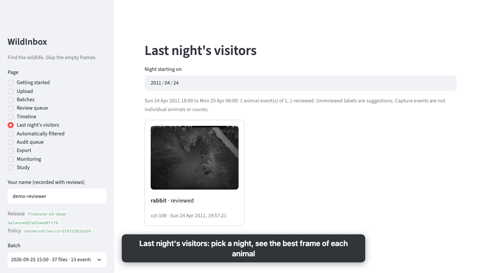

# Demo: from a memory card to a reviewed observation log

About five minutes on a laptop. Uses the committed sample batch
[`samples/cct-dev`](../samples/cct-dev): 37 photos in 13 capture sequences from
Caltech Camera Traps covering every supported species, empty frames, and four
species the model does not support (license and attribution:
[`samples/cct-dev/LICENSE.md`](../samples/cct-dev/LICENSE.md)).

## Video

[`media/demo.webm`](media/demo.webm) (about 80 s, 1280×720) is recorded from the
live application, with nothing staged. It starts from a fresh deployment with the
trained release active, uploads the sample with its card metadata in the
browser, accepts one suggestion, corrects another, opens last night's visitors
and the timeline, exports the observation log, and shows monitoring.

| Upload with card metadata | Review queue | Last night's visitors |
|---|---|---|
|  |  |  |

To record it again against a fresh deployment (steps 1 and the release
registration below; the database must not already hold the sample):

```bash
uv run --with playwright playwright install chromium
uv run --with playwright python scripts/record_demo.py --out docs/media/demo.webm
```

## 1. Start the deployment

```bash
docker compose up -d --build --wait
```

Without a registered model the deployment runs the clearly labeled **test
predictor** (pseudo-random suggestions that exercise the pipeline). To use the
trained model, register it once (weights and policy come from the training
machine):

```bash
docker compose run --rm \
  -v "$PWD/models/finetune-e3-deep-balanced:/app/models/finetune-e3-deep-balanced:ro" \
  -v "$PWD/reports/policy:/app/reports/policy:ro" \
  worker wildinbox release register --activate \
    --policy reports/policy/finetune-e3-deep-balanced-v2/policy.json
curl localhost:8000/version
```

## 2. Scripted walk-through

```bash
uv run python scripts/demo.py
```

It uploads the sample, follows processing, lists the most uncertain events
with the reasons they need review, records one correction, and downloads the
export (`demo-observations.csv`). A run with the trained model:

```
1. Upload the sample batch
  37 photos -> batch d253c36a-…
2. Process
  completed: 13 capture events from 37 photos; 0 unusable file(s)
3. Uncertain events (lowest confidence first)
  dispositions: {'needs_review': 13}
  2012-04-12T02:27:59  cct-108   3 frames  suggested cat (23%): frames disagree; model is unsure; …
  …
4. Record a correction
  event 07161073: suggested cat, corrected to coyote by demo-reviewer
5. Export observations
  13 rows -> demo-observations.csv  ({'pending_review': 12, 'review': 1})
  corrected row: observation=coyote source=review reviewer=demo-reviewer
    release=finetune-e3-deep-balanced@518a8da39ee0 policy=conservative/v1+fe20c7586555
```

Every event goes to review: automatic filtering and acceptance are off because
evaluation did not support them (see the [model card](model_card.md)).

## 3. The same in the browser

Open **http://localhost:8501**:

1. **Upload**: choose the files in `samples/cct-dev/images` and, as the card
   metadata, `samples/cct-dev/metadata.json` (per-file camera, sequence, and
   capture time), then watch progress: 37 photos become 13 capture events.
   Without a metadata file, a camera name applies to every file and photos are
   grouped by EXIF capture time.
2. **Review queue**: enter your name in the sidebar. Each event shows its frames,
   the suggestion, and why it needs review. Accept, choose another label, type an
   unsupported species, or mark "can't tell".
3. **Last night's visitors**: the best frame of every animal event from one night.
4. **Export**: download the observation CSV; reviewed rows carry the reviewer and
   the release, calibration, and policy versions behind the suggestion.

The same photos are recognized by content: uploading them again to the same
deployment reports them as duplicates instead of processing them twice. Reset
with `docker compose down -v` to run the demo from scratch.
