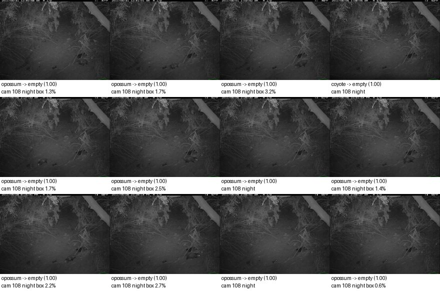
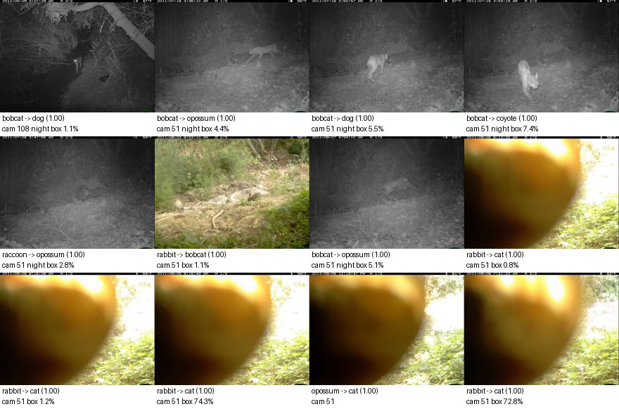
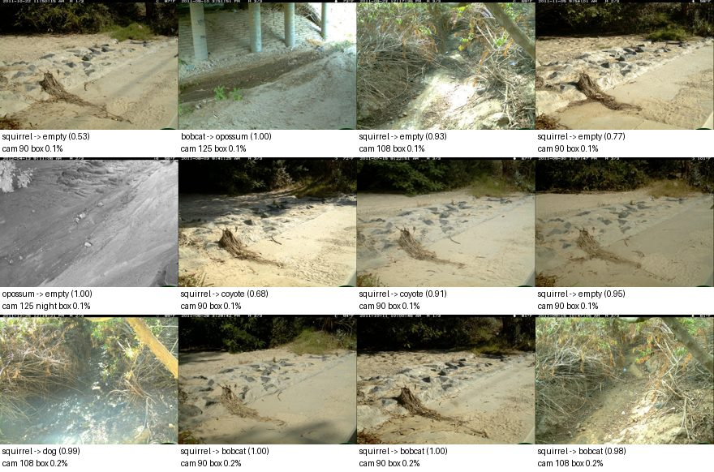
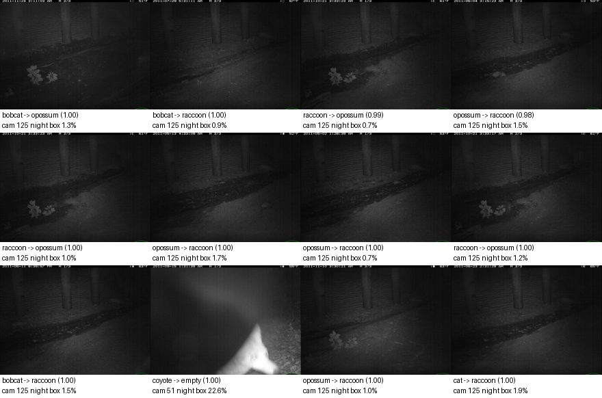
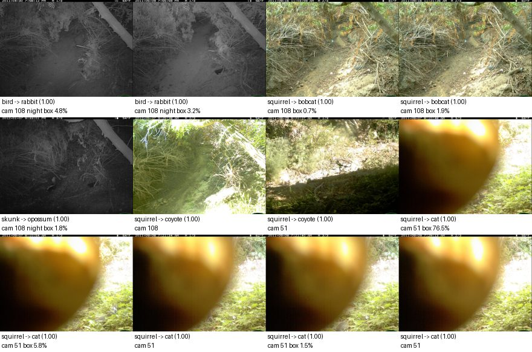

# Baseline report: `baseline-frozen-effnetb0-logreg-v1`

Frozen EfficientNet-B0 (ImageNet) embeddings + class-weighted logistic regression. Development partitions only; **the locked final test was not opened.**

## Headline (unseen cameras: calibration + policy validation)

| Metric | Value |
|---|---|
| Macro-F1, supported classes (image level) | 0.258 |
| Lowest per-species recall | 0.100 |
| Animal events wrongly filtered as empty, at reference thresholds | 164 of 1577 (10.40% [9.0, 12.0]) |
| Events left for review at reference thresholds | 46.3% |

Reference thresholds P(empty) >= 0.9, species >= 0.9 are **reference points, not chosen operating points**; scores are uncalibrated. Thresholds are chosen later on policy validation.

Overall accuracy (28.4%) is **not** a headline metric: a model can score well by predicting the most common classes while missing animals. Macro-F1 weights every class equally; the false-empty count measures the failure that matters most.

## Seen vs unseen cameras

Same model; the diagnostic partition holds out sequences from *training* cameras.

| Partition | Cameras | Images | Macro-F1 | Min species recall | Animal image recall | False-empty events (ref) |
|---|---|---|---|---|---|---|
| unseen_cameras | unseen | 4336 | 0.258 | 0.100 | 83.4% | 164 / 1577 |
| calibration | unseen | 2032 | 0.290 | 0.051 | 72.6% | 143 / 724 |
| policy_validation | unseen | 2304 | 0.212 | 0.000 | 91.2% | 21 / 853 |
| seen_camera_diagnostic | seen (training) | 3568 | 0.724 | 0.635 | 95.8% | 31 / 1441 |

## Image level, unseen cameras

| Class | Precision | Recall | F1 | Support | Predicted |
|---|---|---|---|---|---|
| empty | 0.322 | 0.446 | 0.374 | 652 | 904 |
| bobcat | 0.352 | 0.100 | 0.156 | 1049 | 298 |
| cat | 0.160 | 0.140 | 0.150 | 363 | 319 |
| coyote | 0.209 | 0.436 | 0.283 | 289 | 602 |
| dog | 0.230 | 0.533 | 0.321 | 135 | 313 |
| opossum | 0.444 | 0.364 | 0.400 | 1197 | 982 |
| rabbit | 0.201 | 0.177 | 0.188 | 327 | 289 |
| raccoon | 0.145 | 0.281 | 0.191 | 324 | 629 |

Confusion matrix (rows = true, columns = predicted):

|  | empty | bobcat | cat | coyote | dog | opossum | rabbit | raccoon |
|---|---|---|---|---|---|---|---|---|
| empty | 291 | 68 | 82 | 81 | 26 | 28 | 38 | 38 |
| bobcat | 35 | 105 | 92 | 146 | 117 | 327 | 47 | 180 |
| cat | 51 | 27 | 51 | 122 | 32 | 23 | 8 | 49 |
| coyote | 61 | 12 | 12 | 126 | 3 | 28 | 22 | 25 |
| dog | 16 | 4 | 5 | 27 | 72 | 8 | 0 | 3 |
| opossum | 331 | 43 | 28 | 49 | 19 | 436 | 80 | 211 |
| rabbit | 58 | 35 | 40 | 37 | 44 | 23 | 58 | 32 |
| raccoon | 61 | 4 | 9 | 14 | 0 | 109 | 36 | 91 |

**Unsupported animals** (976 images of species outside the supported set): 540 were given a supported species with confidence >= 0.9. Predicted as: empty 247, bobcat 196, coyote 194, opossum 109, rabbit 86, cat 70, dog 39, raccoon 35.

## Event-level trade-off, unseen cameras

Conservative policy: filter only if **every** frame has P(empty) >= threshold; any animal-looking frame keeps the event; species accepted only if animal frames agree and their mean probability >= species threshold.

Empty threshold sweep (species threshold 0.9):

| P(empty) >= | Filtered | True empty filtered | Animal events filtered (95% CI) | Retention | Review |
|---|---|---|---|---|---|
| 0.5 | 304 / 1847 | 111 / 270 | 193 (12.24% [10.7, 13.9]) | 87.76% | 44.1% |
| 0.7 | 288 / 1847 | 107 / 270 | 181 (11.48% [10.0, 13.1]) | 88.52% | 45.0% |
| 0.8 | 279 / 1847 | 103 / 270 | 176 (11.16% [9.7, 12.8]) | 88.84% | 45.5% |
| 0.9 | 263 / 1847 | 99 / 270 | 164 (10.40% [9.0, 12.0]) | 89.60% | 46.3% |
| 0.95 | 247 / 1847 | 93 / 270 | 154 (9.77% [8.4, 11.3]) | 90.23% | 47.2% |
| 0.99 | 215 / 1847 | 88 / 270 | 127 (8.05% [6.8, 9.5]) | 91.95% | 48.9% |

Species threshold sweep (empty threshold 0.9):

| Species >= | Accepted | Precision (95% CI) | Wrong by true role | Unsupported accepted as known | Review |
|---|---|---|---|---|---|
| 0.5 | 966 / 1847 | 21.5% [19.1, 24.2] | other_supported_species 417, unsupported_animal 194, empty 138, mixed_species 9 | 194 | 33.5% |
| 0.7 | 921 / 1847 | 21.8% [19.3, 24.6] | other_supported_species 399, unsupported_animal 185, empty 127, mixed_species 9 | 185 | 35.9% |
| 0.8 | 842 / 1847 | 22.3% [19.6, 25.3] | other_supported_species 361, unsupported_animal 169, empty 115, mixed_species 9 | 169 | 40.2% |
| 0.9 | 728 / 1847 | 22.3% [19.4, 25.4] | other_supported_species 313, unsupported_animal 144, empty 101, mixed_species 8 | 144 | 46.3% |
| 0.95 | 640 / 1847 | 22.5% [19.4, 25.9] | other_supported_species 270, unsupported_animal 129, empty 90, mixed_species 7 | 129 | 51.1% |
| 0.99 | 487 / 1847 | 22.2% [18.7, 26.1] | other_supported_species 199, unsupported_animal 103, empty 72, mixed_species 5 | 103 | 59.4% |

## Slices, unseen cameras

Event false-empty counts at the reference thresholds. Night = most frames are grayscale infrared.

| Camera | Images | Macro-F1 | Animal image recall | False-empty events |
|---|---|---|---|---|
| 108 | 756 | 0.163 | 51.0% | 98 / 328 |
| 125 | 1594 | 0.200 | 94.4% | 7 / 556 |
| 51 | 1276 | 0.345 | 86.9% | 45 / 396 |
| 90 | 710 | 0.203 | 83.0% | 14 / 297 |

| Condition | Images | Macro-F1 | Animal image recall | False-empty events |
|---|---|---|---|---|
| day | 1308 | 0.233 | 93.2% | 43 / 549 |
| night | 3028 | 0.231 | 80.1% | 121 / 1028 |

## Why each false-empty event was filtered

Every animal event the reference policy would drop, with each frame's P(empty); all frames were above the threshold, which is the only way the conservative policy filters an event.

| Event | Camera | True label | Role | Frame P(empty) |
|---|---|---|---|---|
| 6f0f50c5 | 90 | cat | supported_species | 1.000, 0.994, 1.000 |
| 6f0f7735 | 90 | squirrel | unsupported_animal | 0.952, 0.960, 0.988 |
| 6f0fa6de | 90 | squirrel | unsupported_animal | 0.959, 0.999, 0.996 |
| 6f0fbd0f | 90 | opossum | supported_species | 1.000, 1.000, 0.977 |
| 6f0fc361 | 90 | opossum | supported_species | 1.000, 1.000, 0.999 |
| 6f0fc3ba | 90 | cat | supported_species | 0.991, 0.994, 1.000 |
| 6f0fc417 | 90 | cat | supported_species | 0.992, 0.904, 1.000 |
| 6f0fc4ca | 90 | raccoon | supported_species | 1.000, 1.000, 0.968 |
| 6f0fc523 | 90 | opossum | supported_species | 0.999, 1.000, 1.000 |
| 6f0fc57d | 90 | cat | supported_species | 0.984, 0.993, 0.969 |
| 6f0fc647 | 90 | opossum | supported_species | 1.000, 1.000, 0.999 |
| 6f0fc69e | 90 | opossum | supported_species | 0.998, 0.997, 1.000 |
| 6f0fc917 | 90 | opossum | supported_species | 0.996, 0.996, 0.977 |
| 6f0fc966 | 90 | opossum | supported_species | 1.000, 1.000, 0.999 |
| 6f14bfab | 108 | opossum | supported_species | 0.924, 0.974, 0.911 |
| 6f14c100 | 108 | bird | unsupported_animal | 0.963, 1.000, 1.000 |
| 6f14c694 | 108 | opossum | supported_species | 1.000, 0.978, 1.000 |
| 6f14c6f0 | 108 | opossum | supported_species | 1.000, 1.000, 0.962 |
| 6f14c740 | 108 | opossum | supported_species | 1.000, 0.955, 1.000 |
| 6f14c799 | 108 | opossum | supported_species | 1.000, 0.958, 0.999 |
| 6f14c845 | 108 | bobcat | supported_species | 0.999, 1.000, 0.999 |
| 6f14c8e3 | 108 | bobcat | supported_species | 0.997, 1.000, 1.000 |
| 6f14c933 | 108 | opossum | supported_species | 1.000, 1.000, 1.000 |
| 6f14c985 | 108 | opossum | supported_species | 1.000, 1.000, 1.000 |
| 6f14c9d1 | 108 | opossum | supported_species | 1.000, 1.000, 1.000 |
| 6f14ca23 | 108 | opossum | supported_species | 1.000, 1.000, 1.000 |
| 6f14cbf0 | 108 | coyote | supported_species | 1.000, 1.000, 1.000 |
| 6f14cc40 | 108 | opossum | supported_species | 1.000, 1.000, 1.000 |
| 6f14cc87 | 108 | opossum | supported_species | 1.000, 1.000, 1.000 |
| 6f14cce1 | 108 | opossum | supported_species | 1.000, 1.000, 1.000 |
| 6f14cd30 | 108 | opossum | supported_species | 1.000, 1.000, 1.000 |
| 6f14cd80 | 108 | opossum | supported_species | 1.000, 1.000, 1.000 |
| 6f14cdcf | 108 | opossum | supported_species | 1.000, 1.000, 1.000 |
| 6f14ce28 | 108 | opossum | supported_species | 1.000, 1.000, 1.000 |
| 6f14ce7a | 108 | opossum | supported_species | 1.000, 1.000, 1.000 |
| 6f14ceca | 108 | opossum | supported_species | 1.000, 1.000, 1.000 |
| 6f14cf1c | 108 | opossum | supported_species | 1.000, 1.000, 1.000 |
| 6f14cf68 | 108 | raccoon | supported_species | 1.000, 1.000, 1.000 |
| 6f14cfba | 108 | raccoon | supported_species | 1.000, 1.000, 1.000 |
| 6f14d00a | 108 | raccoon | supported_species | 1.000, 1.000, 1.000 |

...and 124 more in `eval/events.jsonl.gz`.

## Inference time and memory

Declared hardware: Apple M1, 8 GB RAM, macOS-26.6.2-arm64-arm-64bit, torch 2.14.0 (4 threads), device `mps`.

| Stage | Images | Seconds | Images/s | Peak RSS, main process (MB) |
|---|---|---|---|---|
| train_fit | 20287 | 718.6 | 28.23 | 312.4 |
| calibration | 2641 | 83.61 | 31.59 | 385.6 |
| policy_validation | 2732 | 94.27 | 28.98 | 385.6 |
| seen_camera_diagnostic | 4313 | 180.18 | 23.94 | 385.6 |

Single image end to end (decode, preprocess, embed, classify; batch size 1, after warm-up). The Docker deployment runs on CPU.

| Device | Images | p50 ms | p95 ms | Peak RSS, main process (MB) |
|---|---|---|---|---|
| mps | 32 | 23 | 33 | 600 |
| cpu | 32 | 131 | 138 | 600 |

## Error gallery

From the unseen-camera development partitions. Captions: true label -> predicted (confidence), camera, night flag.

### False empty (613 images, 279 events)

Animals predicted empty (highest P(empty) first). These frames are what the empty filter would drop.



<details><summary>Examples</summary>

| Image | Event | Camera | True | Predicted | Conf. | Night | Blur | Box area |
|---|---|---|---|---|---|---|---|---|
| 586c886a | 6f14c985 | 108 | opossum | empty | 1.00 | yes | 667 | 1.3% |
| 58a1cbb5 | 6f14c9d1 | 108 | opossum | empty | 1.00 | yes | 661 | 1.7% |
| 590b9cac | 6f14ca23 | 108 | opossum | empty | 1.00 | yes | 663 | 3.2% |
| 58946073 | 6f14cbf0 | 108 | coyote | empty | 1.00 | yes | 682 | n/a |
| 59279dba | 6f14cc40 | 108 | opossum | empty | 1.00 | yes | 675 | 1.7% |
| 58af74eb | 6f14cc87 | 108 | opossum | empty | 1.00 | yes | 672 | 2.5% |
| 58fd7ba1 | 6f14cce1 | 108 | opossum | empty | 1.00 | yes | 673 | n/a |
| 58a52dd7 | 6f14cd30 | 108 | opossum | empty | 1.00 | yes | 697 | 1.4% |
| 59373578 | 6f14cd80 | 108 | opossum | empty | 1.00 | yes | 699 | 2.2% |
| 592f7329 | 6f14cdcf | 108 | opossum | empty | 1.00 | yes | 708 | 2.7% |
| 59292d74 | 6f14ce28 | 108 | opossum | empty | 1.00 | yes | 684 | n/a |
| 59056009 | 6f14ce7a | 108 | opossum | empty | 1.00 | yes | 689 | 0.6% |

</details>

### Confused species (2132 images, 887 events)

Supported species predicted as another species (most confident mistakes first).



<details><summary>Examples</summary>

| Image | Event | Camera | True | Predicted | Conf. | Night | Blur | Box area |
|---|---|---|---|---|---|---|---|---|
| 586c884d | 6f152d3d | 108 | bobcat | dog | 1.00 | yes | 728 | 1.1% |
| 59be406d | 6f1c7bc0 | 51 | bobcat | opossum | 1.00 | yes | 469 | 4.4% |
| 59c17936 | 6f1c8321 | 51 | bobcat | dog | 1.00 | yes | 482 | 5.5% |
| 59c99fcd | 6f1c84a6 | 51 | bobcat | coyote | 1.00 | yes | 479 | 7.4% |
| 599fbfae | 6f1c9042 | 51 | raccoon | opossum | 1.00 | yes | 491 | 2.8% |
| 598f78e2 | 6f1c9e70 | 51 | rabbit | bobcat | 1.00 |  | 1642 | 1.1% |
| 59bac9f8 | 6f1ca2e3 | 51 | bobcat | opossum | 1.00 | yes | 480 | 5.1% |
| 59b2e8b5 | 6f1ccc38 | 51 | rabbit | cat | 1.00 |  | 989 | 0.8% |
| 597fee64 | 6f1ccc7d | 51 | rabbit | cat | 1.00 |  | 1021 | 1.2% |
| 5a1309a6 | 6f1ccccc | 51 | rabbit | cat | 1.00 |  | 1021 | 74.3% |
| 59b131bd | 6f1ccd1e | 51 | opossum | cat | 1.00 |  | 1048 | n/a |
| 5976a440 | 6f1cd21e | 51 | rabbit | cat | 1.00 |  | 981 | 72.8% |

</details>

### Small animals (690 images, 372 events)

Misclassified animals whose largest box covers < 1% of the frame.



<details><summary>Examples</summary>

| Image | Event | Camera | True | Predicted | Conf. | Night | Blur | Box area |
|---|---|---|---|---|---|---|---|---|
| 592c4e9f | 6f0f7ca3 | 90 | squirrel | empty | 0.53 |  | 1277 | 0.1% |
| 5876826a | 6f15eae3 | 125 | bobcat | opossum | 1.00 |  | 1184 | 0.1% |
| 587680f6 | 6f14f8d1 | 108 | squirrel | empty | 0.93 |  | 3875 | 0.1% |
| 58ede390 | 6f0f8559 | 90 | squirrel | empty | 0.77 |  | 1883 | 0.1% |
| 593a4e63 | 6f163b47 | 125 | opossum | empty | 1.00 | yes | 969 | 0.1% |
| 59484629 | 6f0f6ff0 | 90 | squirrel | coyote | 0.68 |  | 1791 | 0.1% |
| 591fd1bd | 6f0f6aa1 | 90 | squirrel | coyote | 0.91 |  | 881 | 0.1% |
| 58a37ccf | 6f0f7857 | 90 | squirrel | empty | 0.95 |  | 811 | 0.1% |
| 59484744 | 6f150570 | 108 | squirrel | dog | 0.99 |  | 2555 | 0.2% |
| 593d68d7 | 6f0f6778 | 90 | squirrel | bobcat | 1.00 |  | 986 | 0.2% |
| 5938c325 | 6f0f7a75 | 90 | squirrel | bobcat | 1.00 |  | 1659 | 0.2% |
| 58b9d6d4 | 6f14ee78 | 108 | squirrel | bobcat | 0.98 |  | 3670 | 0.2% |

</details>

### Blurred (372 images, 159 events)

Misclassified images in the blurriest 10% (variance of Laplacian < 338).



<details><summary>Examples</summary>

| Image | Event | Camera | True | Predicted | Conf. | Night | Blur | Box area |
|---|---|---|---|---|---|---|---|---|
| 58bb8c53 | 6f15fd2b | 125 | bobcat | opossum | 1.00 | yes | 288 | 1.3% |
| 58823d30 | 6f15db57 | 125 | bobcat | raccoon | 1.00 | yes | 297 | 0.9% |
| 5911d7e6 | 6f15f726 | 125 | raccoon | opossum | 0.99 | yes | 299 | 0.7% |
| 58e93bf2 | 6f15b7de | 125 | opossum | raccoon | 0.98 | yes | 299 | 1.5% |
| 5935a620 | 6f15f6d9 | 125 | raccoon | opossum | 1.00 | yes | 299 | 1.0% |
| 585c048c | 6f15ae57 | 125 | opossum | raccoon | 1.00 | yes | 300 | 1.7% |
| 59279cda | 6f15ab87 | 125 | opossum | raccoon | 1.00 | yes | 301 | 0.7% |
| 58823c6c | 6f15f687 | 125 | raccoon | opossum | 1.00 | yes | 303 | 1.2% |
| 5887187d | 6f15c135 | 125 | bobcat | raccoon | 1.00 | yes | 303 | 1.5% |
| 5989433e | 6f1ce43d | 51 | coyote | empty | 1.00 | yes | 303 | 22.6% |
| 58dc4d3b | 6f15fab5 | 125 | opossum | raccoon | 1.00 | yes | 305 | 1.0% |
| 58e0f61c | 6f15c828 | 125 | cat | raccoon | 1.00 | yes | 305 | 1.9% |

</details>

### Unfamiliar inputs (729 images, 266 events)

Unsupported animals labeled as a supported species (most confident first). Confidence alone does not reject them.



<details><summary>Examples</summary>

| Image | Event | Camera | True | Predicted | Conf. | Night | Blur | Box area |
|---|---|---|---|---|---|---|---|---|
| 58f108a1 | 6f14b911 | 108 | bird | rabbit | 1.00 | yes | 589 | 4.8% |
| 58c4d656 | 6f14be61 | 108 | bird | rabbit | 1.00 | yes | 664 | 3.2% |
| 5913655b | 6f14eec7 | 108 | squirrel | bobcat | 1.00 |  | 3617 | 0.7% |
| 58995973 | 6f14ef19 | 108 | squirrel | bobcat | 1.00 |  | 3638 | 1.9% |
| 586291b4 | 6f1506b8 | 108 | skunk | opossum | 1.00 | yes | 595 | 1.8% |
| 58d47c5f | 6f152ba3 | 108 | squirrel | coyote | 1.00 |  | 3237 | n/a |
| 59d8eb79 | 6f1cb05e | 51 | squirrel | coyote | 1.00 |  | 2611 | n/a |
| 59f12b05 | 6f1ccdab | 51 | squirrel | cat | 1.00 |  | 1029 | 76.5% |
| 5a17dd45 | 6f1ccdfa | 51 | squirrel | cat | 1.00 |  | 1013 | 5.8% |
| 59e91aea | 6f1cd140 | 51 | squirrel | cat | 1.00 |  | 904 | n/a |
| 5a116d1a | 6f1cd187 | 51 | squirrel | cat | 1.00 |  | 909 | 1.5% |
| 5a1e50af | 6f1cd517 | 51 | squirrel | cat | 1.00 |  | 931 | n/a |

</details>

## Setup and reproduction

|  |  |
|---|---|
| Training images (use_for_fit) | 20287: bobcat 1331, cat 2428, coyote 2367, dog 1531, empty 1318, opossum 5947, rabbit 3638, raccoon 1727 |
| Backbone | torchvision EfficientNet-B0, IMAGENET1K_V1, frozen (ImageNet-1k pretraining; no wildlife-specific checkpoint, so no overlap with CCT20) |
| Classifier | logistic regression, C=1.0, class_weight=balanced |
| Split / inventory | `cct20-splits-v1-7de740aba75f` / `cct20-396eb43cc6ce` |
| Preprocessing | `6d9a950a6543` |
| Seed | 20260924 |
| Code | `189dbb13b3d55b5ff6dafd4725e0f765a811fdf0` |
| MLflow run | `b01897994d4245d0aa070c499dc47e06` |

```bash
uv run wildinbox baseline train          # embed + fit
uv run wildinbox evaluate                # this report + metrics.json
uv run wildinbox baseline train --no-cache --models-dir /tmp/fresh
uv run wildinbox evaluate --model /tmp/fresh/baseline-frozen-effnetb0-logreg-v1 --report-dir /tmp/fresh-report --compare-to reports/baseline/metrics.json
```

Tolerances (absolute): macro_f1 0.005, per_class_recall 0.01, false_empty_rate 0.005.

## Limitations

- Scores are uncalibrated; thresholds above are reference points only.
- Unseen-camera results rest on 4 development cameras; see the per-camera table.
- CCT20 is ~7% empty, so empty-filtering volume here understates a real memory card.
- Day/night is inferred from grayscale (infrared) frames, not from timestamps.
