# Data-quality report: `cct20-396eb43cc6ce`

Generated by `wildinbox data report`. Every source record is accounted for as accepted, quarantined, or excluded.

## Accounting

|  | Records |
|---|---|
| Source records | 57864 |
| accepted | 57855 |
| quarantined | 2 |
| excluded | 7 |

**Reasons** (a record can have more than one):

| Reason | Records |
|---|---|
| conflicting_annotations | 2 |
| exact_duplicate | 7 |

- Annotations referring to no image: **0**
- Image files not referenced by any metadata: **0**

## Class counts (accepted records)

Columns are the published CCT20 benchmark files each record came from. Labels are `lowercase_snake(category name)`; originals are kept unchanged in the inventory.

| Label | Total | cis_test | cis_val | train | trans_test | trans_val |
|---|---|---|---|---|---|---|
| opossum | 13688 | 4524 | 490 | 2726 | 5504 | 444 |
| raccoon | 7841 | 1047 | 169 | 1027 | 5469 | 129 |
| rabbit | 5545 | 1757 | 493 | 2443 | 843 | 9 |
| coyote | 5309 | 1324 | 285 | 1402 | 2249 | 49 |
| bobcat | 4899 | 897 | 154 | 785 | 2329 | 734 |
| cat | 4601 | 1632 | 192 | 1287 | 1418 | 72 |
| empty | 4014 | 1180 | 995 | 0 | 1778 | 61 |
| squirrel | 3180 | 659 | 222 | 1249 | 1050 | 0 |
| dog | 2783 | 842 | 139 | 818 | 888 | 96 |
| car | 2613 | 791 | 41 | 668 | 1113 | 0 |
| bird | 1402 | 573 | 114 | 484 | 224 | 7 |
| skunk | 857 | 194 | 43 | 229 | 328 | 63 |
| rodent | 809 | 233 | 143 | 375 | 58 | 0 |
| deer | 206 | 161 | 3 | 42 | 0 | 0 |
| (multi-species, unlabeled) | 78 | 1 | 0 | 7 | 9 | 61 |
| badger | 22 | 4 | 1 | 3 | 14 | 0 |
| fox | 8 | 2 | 0 | 5 | 1 | 0 |

## Cameras

20 cameras with accepted records.

| Camera | Images | Empty % | Classes | Benchmark files |
|---|---|---|---|---|
| 38 | 9773 | 2 | 10 | cis_test, cis_val, train |
| 46 | 6276 | 12 | 13 | trans_test |
| 100 | 4890 | 4 | 11 | trans_test |
| 43 | 4108 | 14 | 12 | cis_test, cis_val, train |
| 33 | 3997 | 9 | 9 | cis_test, cis_val, train |
| 88 | 3100 | 4 | 9 | cis_test, cis_val, train |
| 120 | 3082 | 2 | 12 | cis_test, cis_val, train |
| 115 | 2773 | 8 | 10 | cis_test, cis_val, train |
| 61 | 2374 | 3 | 8 | cis_test, cis_val, train |
| 78 | 2359 | 8 | 10 | trans_test |
| 105 | 2169 | 4 | 8 | trans_test |
| 0 | 1861 | 2 | 11 | trans_test |
| 7 | 1853 | 10 | 8 | trans_test |
| 125 | 1725 | 4 | 10 | trans_val |
| 51 | 1519 | 22 | 9 | cis_test, cis_val, train |
| 130 | 1455 | 7 | 11 | trans_test |
| 28 | 1333 | 11 | 10 | trans_test |
| 108 | 1122 | 12 | 10 | cis_test, cis_val, train |
| 40 | 1079 | 10 | 10 | trans_test |
| 90 | 1007 | 12 | 8 | cis_test, cis_val, train |

## Sequence sizes

| Frames in sequence | Sequences |
|---|---|
| 1 | 5339 |
| 2 | 43 |
| 3 | 17123 |
| 5 | 214 |

## Missing fields

| Field | Records missing it |
|---|---|
| camera (location) | 0 |
| sequence id | 0 |
| timestamp | 0 |
| frame number | 0 |
| image file | 0 |

## Duplicates and warnings

- Exact duplicates (identical bytes) excluded: **7**
- Suspected near-duplicates across different cameras (high-pass thumbnail similarity >= 0.8): **0 pairs**. Frames within one camera are expected to look alike and are not flagged, since splits hold out whole cameras.

| Warning (record stays accepted) | Records |
|---|---|
| multi_species | 78 |
| sequence_incomplete | 473 |

## Quarantined and excluded records

| Source id | Status | Reasons | File |
|---|---|---|---|
| 58823baa-23d2-11e8-a6a3-ec086b02610b | quarantined | conflicting_annotations: identical file 4d891fdc46bb labeled differently across ['58823baa-23d2-11e8-a6a3-ec086b02610b', '59310064-23d2-11e8-a6a3-ec086b02610b'] | 58823baa-23d2-11e8-a6a3-ec086b02610b.jpg |
| 59055df3-23d2-11e8-a6a3-ec086b02610b | excluded | exact_duplicate: same bytes as 58c7f109-23d2-11e8-a6a3-ec086b02610b | 59055df3-23d2-11e8-a6a3-ec086b02610b.jpg |
| 591fd344-23d2-11e8-a6a3-ec086b02610b | excluded | exact_duplicate: same bytes as 58cca523-23d2-11e8-a6a3-ec086b02610b | 591fd344-23d2-11e8-a6a3-ec086b02610b.jpg |
| 5922ec43-23d2-11e8-a6a3-ec086b02610b | excluded | exact_duplicate: same bytes as 58f10746-23d2-11e8-a6a3-ec086b02610b | 5922ec43-23d2-11e8-a6a3-ec086b02610b.jpg |
| 592ac086-23d2-11e8-a6a3-ec086b02610b | excluded | exact_duplicate: same bytes as 58b2ed0a-23d2-11e8-a6a3-ec086b02610b | 592ac086-23d2-11e8-a6a3-ec086b02610b.jpg |
| 592c4e69-23d2-11e8-a6a3-ec086b02610b | excluded | exact_duplicate: same bytes as 58eac917-23d2-11e8-a6a3-ec086b02610b | 592c4e69-23d2-11e8-a6a3-ec086b02610b.jpg |
| 592f7067-23d2-11e8-a6a3-ec086b02610b | excluded | exact_duplicate: same bytes as 5894628d-23d2-11e8-a6a3-ec086b02610b | 592f7067-23d2-11e8-a6a3-ec086b02610b.jpg |
| 5930fe72-23d2-11e8-a6a3-ec086b02610b | excluded | exact_duplicate: same bytes as 58fa5fb4-23d2-11e8-a6a3-ec086b02610b | 5930fe72-23d2-11e8-a6a3-ec086b02610b.jpg |
| 59310064-23d2-11e8-a6a3-ec086b02610b | quarantined | conflicting_annotations: identical file 4d891fdc46bb labeled differently across ['58823baa-23d2-11e8-a6a3-ec086b02610b', '59310064-23d2-11e8-a6a3-ec086b02610b'] | 59310064-23d2-11e8-a6a3-ec086b02610b.jpg |

## Visual samples

Random accepted examples per class (seed 0).

### opossum

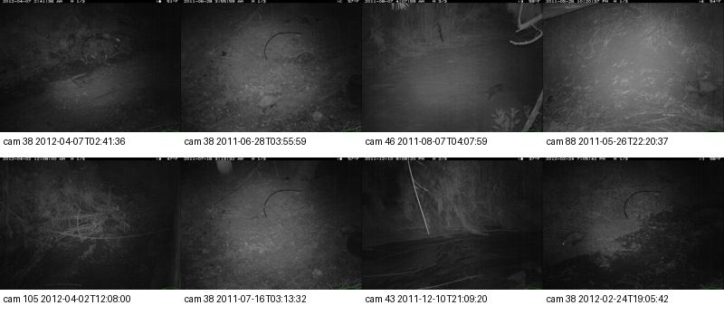

### raccoon

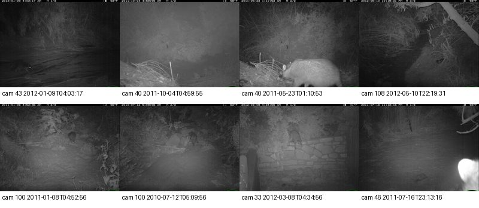

### rabbit

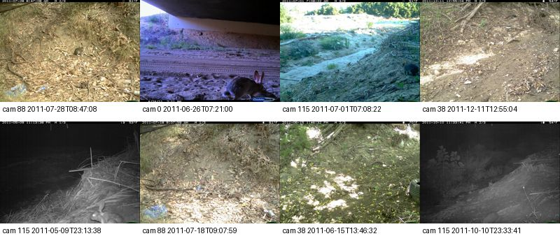

### coyote

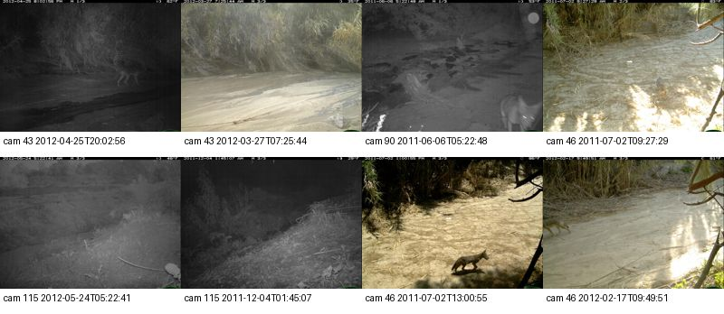

### bobcat

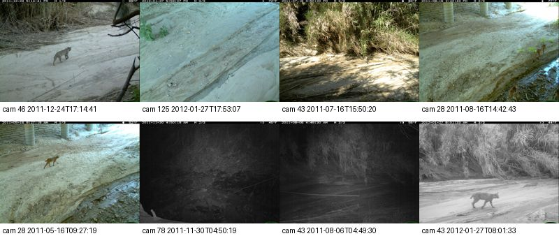

### cat

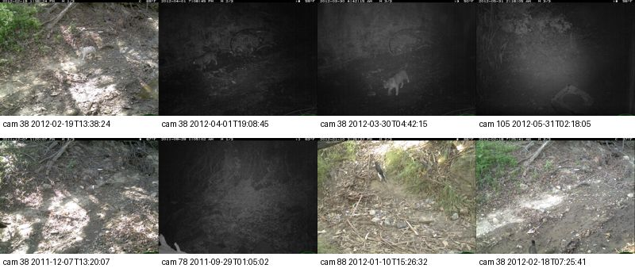

### empty

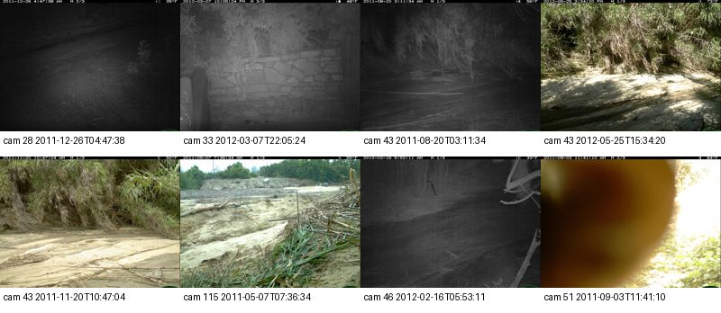

### squirrel

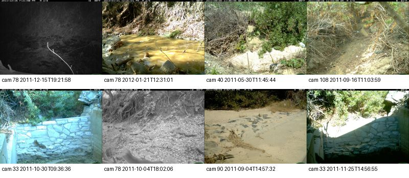

### dog

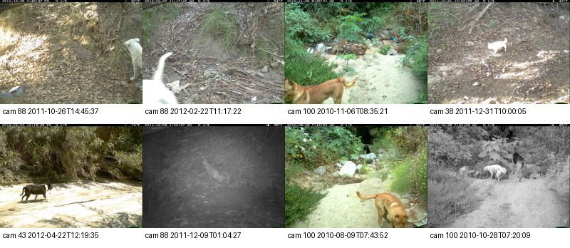

### car

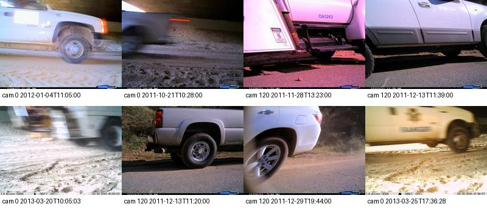

### bird

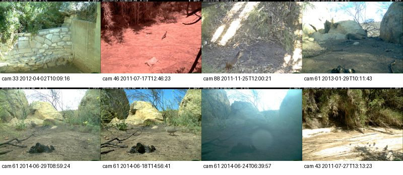

### skunk

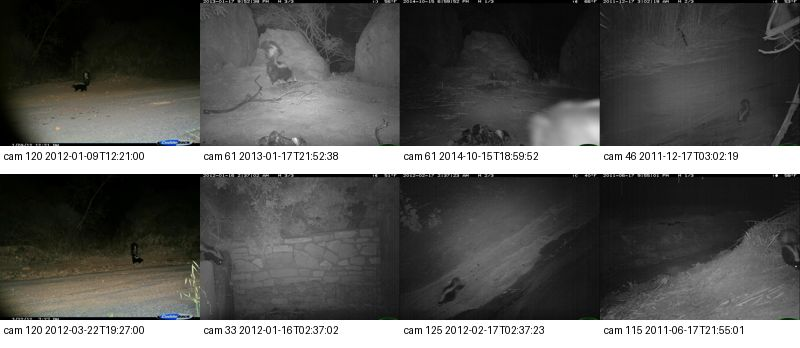

### rodent

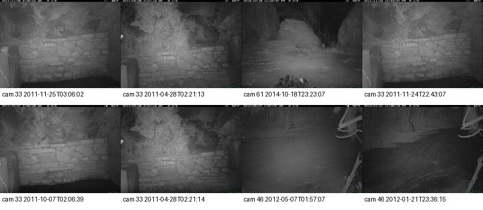

### deer

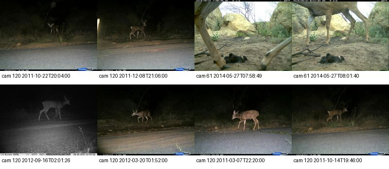

### (multi-species, unlabeled)

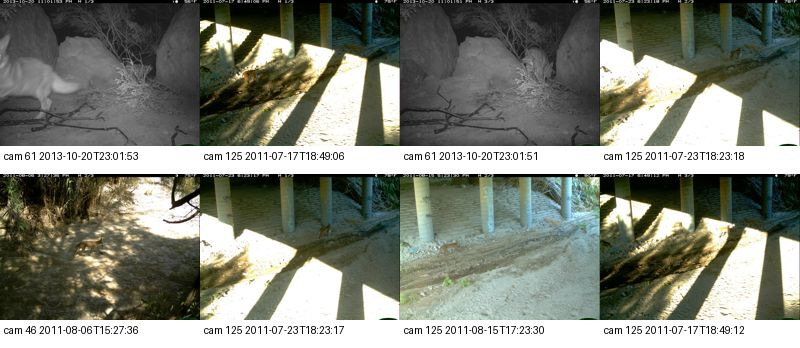

### badger

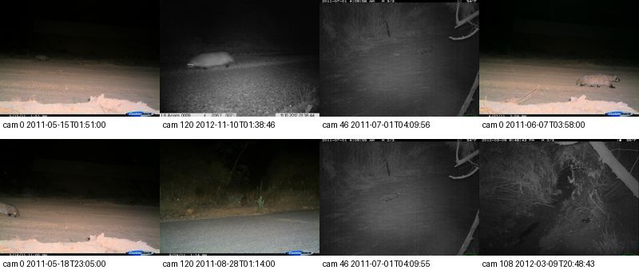

### fox

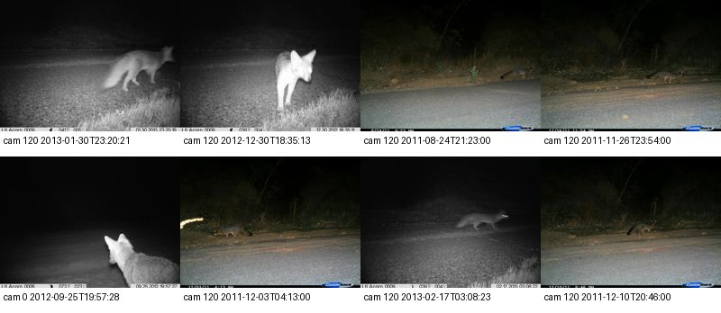

## Suspicious records

Quarantined files, cross-camera near-duplicate pairs (shown side by side), and records with warnings.

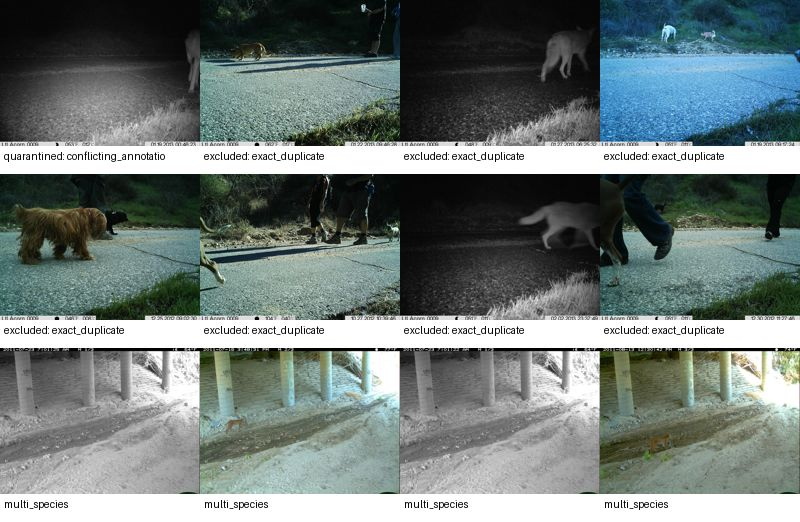

---

Images: Caltech Camera Traps (CCT20), via LILA BC, Community Data License Agreement (permissive variant).
