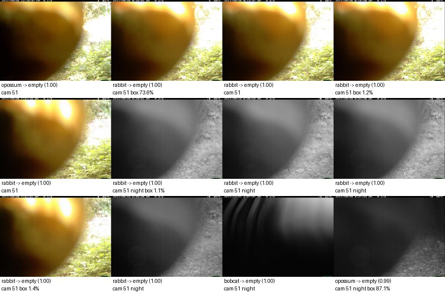
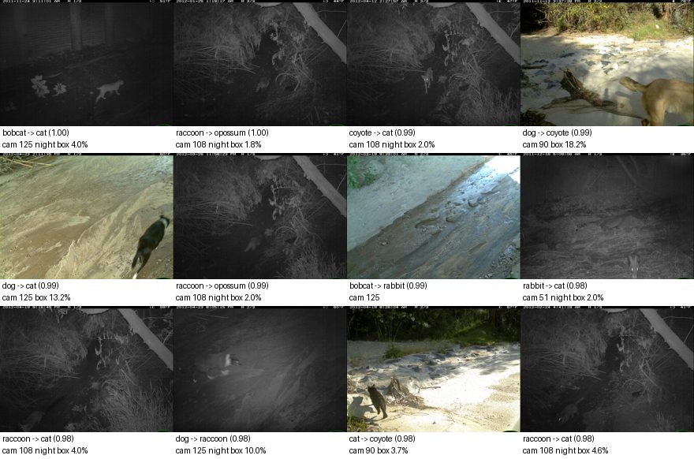
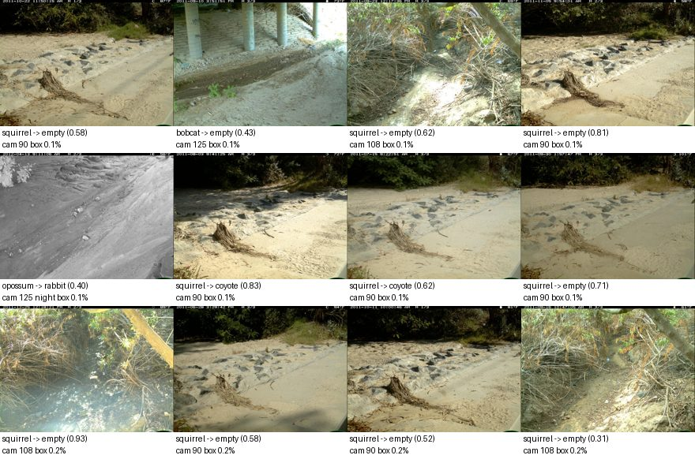
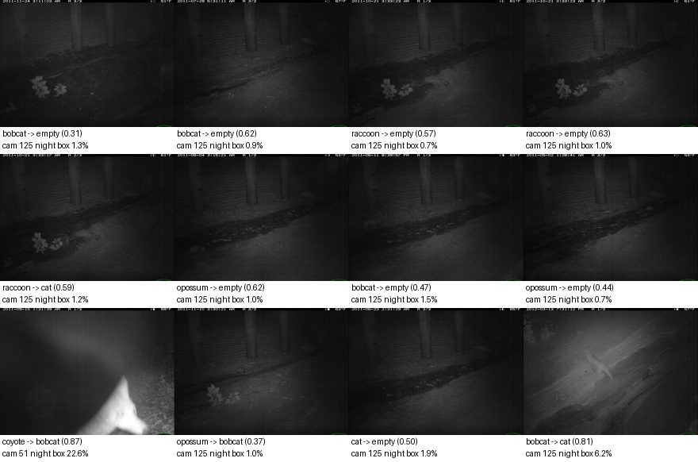
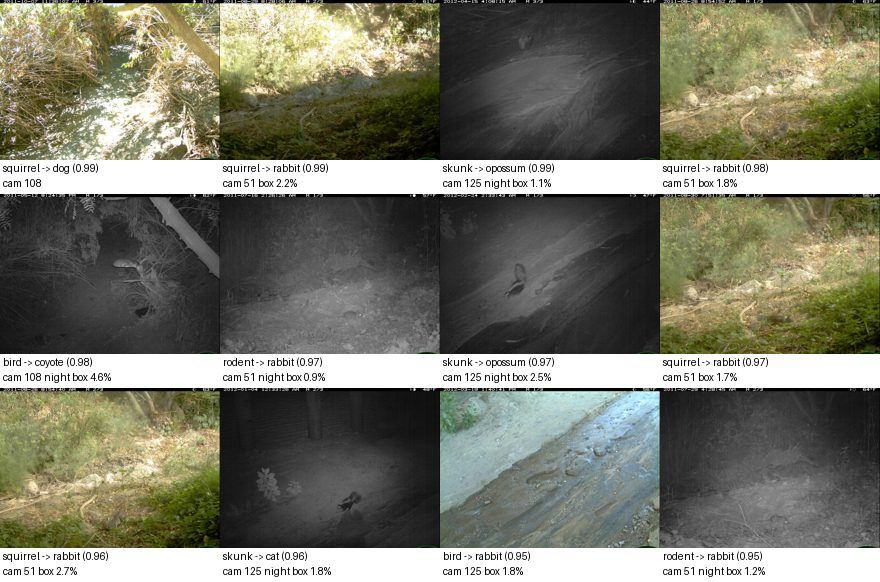

# Model report: `finetune-e1-top-lossweight`

E1: fine-tune blocks 6-8 + head; class-weighted loss; flip + box-safe crop. Development partitions only; **the locked final test was not opened.**

## Headline (unseen cameras: calibration + policy validation)

| Metric | Value |
|---|---|
| Macro-F1, supported classes (image level) | 0.385 |
| Lowest per-species recall | 0.208 |
| Animal events wrongly filtered as empty, at reference thresholds | 60 of 1577 (3.80% [3.0, 4.9]) |
| Events left for review at reference thresholds | 82.1% |

Reference thresholds P(empty) >= 0.9, species >= 0.9 are **reference points, not chosen operating points**; scores are uncalibrated. Thresholds are chosen later on policy validation.

Overall accuracy (42.2%) is **not** a headline metric: a model can score well by predicting the most common classes while missing animals. Macro-F1 weights every class equally; the false-empty count measures the failure that matters most.

## Seen vs unseen cameras

Same model; the diagnostic partition holds out sequences from *training* cameras.

| Partition | Cameras | Images | Macro-F1 | Min species recall | Animal image recall | False-empty events (ref) |
|---|---|---|---|---|---|---|
| unseen_cameras | unseen | 4336 | 0.385 | 0.208 | 68.8% | 60 / 1577 |
| calibration | unseen | 2032 | 0.377 | 0.167 | 75.7% | 57 / 724 |
| policy_validation | unseen | 2304 | 0.384 | 0.048 | 63.7% | 3 / 853 |
| seen_camera_diagnostic | seen (training) | 3568 | 0.760 | 0.730 | 90.9% | 26 / 1441 |

## Image level, unseen cameras

| Class | Precision | Recall | F1 | Support | Predicted |
|---|---|---|---|---|---|
| empty | 0.317 | 0.817 | 0.456 | 652 | 1684 |
| bobcat | 0.778 | 0.444 | 0.566 | 1049 | 599 |
| cat | 0.154 | 0.215 | 0.180 | 363 | 505 |
| coyote | 0.285 | 0.491 | 0.360 | 289 | 499 |
| dog | 0.347 | 0.496 | 0.409 | 135 | 193 |
| opossum | 0.835 | 0.317 | 0.459 | 1197 | 454 |
| rabbit | 0.263 | 0.208 | 0.232 | 327 | 259 |
| raccoon | 0.685 | 0.302 | 0.420 | 324 | 143 |

Confusion matrix (rows = true, columns = predicted):

|  | empty | bobcat | cat | coyote | dog | opossum | rabbit | raccoon |
|---|---|---|---|---|---|---|---|---|
| empty | 533 | 4 | 46 | 46 | 15 | 0 | 7 | 1 |
| bobcat | 221 | 466 | 134 | 86 | 58 | 19 | 50 | 15 |
| cat | 164 | 18 | 78 | 65 | 7 | 18 | 8 | 5 |
| coyote | 90 | 16 | 23 | 142 | 6 | 1 | 4 | 7 |
| dog | 17 | 5 | 6 | 9 | 67 | 3 | 26 | 2 |
| opossum | 452 | 66 | 91 | 93 | 28 | 379 | 73 | 15 |
| rabbit | 124 | 6 | 70 | 45 | 12 | 2 | 68 | 0 |
| raccoon | 83 | 18 | 57 | 13 | 0 | 32 | 23 | 98 |

**Unsupported animals** (976 images of species outside the supported set): 34 were given a supported species with confidence >= 0.9. Predicted as: empty 489, coyote 187, rabbit 117, dog 64, cat 48, opossum 35, bobcat 28, raccoon 8.

## Event-level trade-off, unseen cameras

Conservative policy: filter only if **every** frame has P(empty) >= threshold; any animal-looking frame keeps the event; species accepted only if animal frames agree and their mean probability >= species threshold.

Empty threshold sweep (species threshold 0.9):

| P(empty) >= | Filtered | True empty filtered | Animal events filtered (95% CI) | Retention | Review |
|---|---|---|---|---|---|
| 0.5 | 467 / 1847 | 199 / 270 | 268 (16.99% [15.2, 18.9]) | 83.01% | 67.3% |
| 0.7 | 325 / 1847 | 175 / 270 | 150 (9.51% [8.2, 11.1]) | 90.49% | 75.0% |
| 0.8 | 264 / 1847 | 153 / 270 | 111 (7.04% [5.9, 8.4]) | 92.96% | 78.3% |
| 0.9 | 194 / 1847 | 134 / 270 | 60 (3.80% [3.0, 4.9]) | 96.20% | 82.1% |
| 0.95 | 173 / 1847 | 124 / 270 | 49 (3.11% [2.4, 4.1]) | 96.89% | 83.2% |
| 0.99 | 129 / 1847 | 98 / 270 | 31 (1.97% [1.4, 2.8]) | 98.03% | 85.6% |

Species threshold sweep (empty threshold 0.9):

| Species >= | Accepted | Precision (95% CI) | Wrong by true role | Unsupported accepted as known | Review |
|---|---|---|---|---|---|
| 0.5 | 648 / 1847 | 49.8% [46.0, 53.7] | other_supported_species 162, unsupported_animal 125, empty 27, mixed_species 11 | 125 | 54.4% |
| 0.7 | 382 / 1847 | 62.0% [57.1, 66.8] | other_supported_species 69, unsupported_animal 57, empty 11, mixed_species 8 | 57 | 68.8% |
| 0.8 | 261 / 1847 | 68.2% [62.3, 73.6] | other_supported_species 45, unsupported_animal 29, mixed_species 6, empty 3 | 29 | 75.4% |
| 0.9 | 137 / 1847 | 75.9% [68.1, 82.3] | unsupported_animal 14, other_supported_species 13, mixed_species 4, empty 2 | 14 | 82.1% |
| 0.95 | 80 / 1847 | 86.2% [77.0, 92.1] | other_supported_species 4, mixed_species 4, unsupported_animal 3 | 3 | 85.2% |
| 0.99 | 28 / 1847 | 100.0% [87.9, 100.0] | - | 0 | 88.0% |

## Slices, unseen cameras

Event false-empty counts at the reference thresholds. Night = most frames are grayscale infrared.

| Camera | Images | Macro-F1 | Animal image recall | False-empty events |
|---|---|---|---|---|
| 108 | 756 | 0.247 | 76.7% | 6 / 328 |
| 125 | 1594 | 0.356 | 67.3% | 3 / 556 |
| 51 | 1276 | 0.438 | 75.0% | 51 / 396 |
| 90 | 710 | 0.365 | 54.5% | 0 / 297 |

| Condition | Images | Macro-F1 | Animal image recall | False-empty events |
|---|---|---|---|---|
| day | 1308 | 0.386 | 75.4% | 32 / 549 |
| night | 3028 | 0.310 | 66.6% | 28 / 1028 |

## Why each false-empty event was filtered

Every animal event the reference policy would drop, with each frame's P(empty); all frames were above the threshold, which is the only way the conservative policy filters an event.

| Event | Camera | True label | Role | Frame P(empty) |
|---|---|---|---|---|
| 6f14e90a | 108 | rabbit | supported_species | 0.939, 0.960, 0.949 |
| 6f14eb94 | 108 | squirrel | unsupported_animal | 0.972, 0.983, 0.984 |
| 6f14f419 | 108 | squirrel | unsupported_animal | 0.924, 0.926, 0.939 |
| 6f150570 | 108 | squirrel | unsupported_animal | 0.963, 0.931, 0.944 |
| 6f15250a | 108 | rabbit | supported_species | 0.966, 0.969, 0.962 |
| 6f15281e | 108 | rabbit | supported_species | 0.926, 0.929, 0.935 |
| 6f15c96b | 125 | cat | supported_species | 0.978, 0.976, 0.979 |
| 6f15ff51 | 125 | bobcat | supported_species | 0.958, 0.960, 0.944 |
| 6f1666cc | 125 | cat | supported_species | 0.956, 0.917, 0.950 |
| 6f1ca117 | 51 | squirrel | unsupported_animal | 0.981, 0.981, 0.984 |
| 6f1cac30 | 51 | squirrel | unsupported_animal | 0.914, 0.966, 0.936 |
| 6f1cc291 | 51 | squirrel | unsupported_animal | 1.000, 1.000, 1.000 |
| 6f1cc2e1 | 51 | squirrel | unsupported_animal | 1.000, 1.000, 1.000 |
| 6f1cc4f3 | 51 | opossum | supported_species | 0.988, 0.971, 0.934 |
| 6f1cc670 | 51 | opossum | supported_species | 0.970, 0.973, 0.952 |
| 6f1ccaba | 51 | squirrel | unsupported_animal | 1.000, 1.000, 1.000 |
| 6f1ccb00 | 51 | squirrel | unsupported_animal | 1.000, 1.000, 1.000 |
| 6f1ccb51 | 51 | squirrel | unsupported_animal | 1.000, 1.000, 1.000 |
| 6f1ccbe8 | 51 | squirrel | unsupported_animal | 1.000, 1.000, 1.000 |
| 6f1ccc38 | 51 | rabbit | supported_species | 1.000, 1.000, 1.000 |
| 6f1ccc7d | 51 | rabbit | supported_species | 1.000, 1.000, 1.000 |
| 6f1ccccc | 51 | rabbit | supported_species | 1.000, 1.000, 1.000 |
| 6f1ccd1e | 51 | opossum | supported_species | 1.000, 1.000, 1.000 |
| 6f1ccdab | 51 | squirrel | unsupported_animal | 0.999, 0.999, 0.999 |
| 6f1ccdfa | 51 | squirrel | unsupported_animal | 0.999, 0.999, 0.999 |
| 6f1cd0a1 | 51 | opossum | supported_species | 0.991, 0.993, 0.990 |
| 6f1cd140 | 51 | squirrel | unsupported_animal | 1.000, 1.000, 1.000 |
| 6f1cd187 | 51 | squirrel | unsupported_animal | 1.000, 1.000, 1.000 |
| 6f1cd1d7 | 51 | rabbit | supported_species | 0.999, 0.999, 0.999 |
| 6f1cd21e | 51 | rabbit | supported_species | 0.999, 0.999, 0.999 |
| 6f1cd2b5 | 51 | opossum | supported_species | 0.994, 0.990, 0.987 |
| 6f1cd430 | 51 | rabbit | supported_species | 0.999, 0.999, 0.999 |
| 6f1cd475 | 51 | rabbit | supported_species | 0.999, 0.999, 0.999 |
| 6f1cd4c5 | 51 | squirrel | unsupported_animal | 1.000, 1.000, 1.000 |
| 6f1cd517 | 51 | squirrel | unsupported_animal | 0.999, 0.999, 0.999 |
| 6f1cd55c | 51 | squirrel | unsupported_animal | 0.997, 0.997, 0.997 |
| 6f1cd5ab | 51 | squirrel | unsupported_animal | 0.997, 0.997, 0.996 |
| 6f1cd5f3 | 51 | opossum | supported_species | 0.970, 0.976, 0.972 |
| 6f1cd78c | 51 | squirrel | unsupported_animal | 0.999, 1.000, 0.999 |
| 6f1cd930 | 51 | squirrel | unsupported_animal | 0.999, 0.999, 0.999 |

...and 20 more in `eval/events.jsonl.gz`.

## Inference time and memory

Declared hardware: Apple M1, 8 GB RAM, macOS-26.6.2-arm64-arm-64bit, torch 2.14.0 (4 threads), device `mps`.

| Stage | Images | Seconds | Images/s | Peak RSS, main process (MB) |
|---|---|---|---|---|
| calibration | 2641 | 61.13 | 43.2 | 305.2 |
| policy_validation | 2732 | 63.24 | 43.2 | 305.2 |
| seen_camera_diagnostic | 4313 | 113.87 | 37.88 | 305.2 |

Single image end to end (decode, preprocess, embed, classify; batch size 1, after warm-up). The Docker deployment runs on CPU.

| Device | Images | p50 ms | p95 ms | Peak RSS, main process (MB) |
|---|---|---|---|---|
| mps | 32 | 20 | 21 | 468 |
| cpu | 32 | 130 | 136 | 474 |

## Error gallery

From the unseen-camera development partitions. Captions: true label -> predicted (confidence), camera, night flag.

### False empty (1151 images, 553 events)

Animals predicted empty (highest P(empty) first). These frames are what the empty filter would drop.



<details><summary>Examples</summary>

| Image | Event | Camera | True | Predicted | Conf. | Night | Blur | Box area |
|---|---|---|---|---|---|---|---|---|
| 59b131bd | 6f1ccd1e | 51 | opossum | empty | 1.00 |  | 1048 | n/a |
| 59ec5339 | 6f1ccccc | 51 | rabbit | empty | 1.00 |  | 1018 | 73.6% |
| 59bfdf53 | 6f1ccc38 | 51 | rabbit | empty | 1.00 |  | 998 | n/a |
| 597fee64 | 6f1ccc7d | 51 | rabbit | empty | 1.00 |  | 1021 | 1.2% |
| 599be822 | 6f1cd1d7 | 51 | rabbit | empty | 1.00 |  | 978 | n/a |
| 59973c90 | 6f1cd430 | 51 | rabbit | empty | 1.00 | yes | 511 | 1.1% |
| 598c5de0 | 6f1cdf5c | 51 | rabbit | empty | 1.00 | yes | 519 | n/a |
| 59b48488 | 6f1cd475 | 51 | rabbit | empty | 1.00 | yes | 522 | n/a |
| 59c31b79 | 6f1cd21e | 51 | rabbit | empty | 1.00 |  | 977 | 1.4% |
| 59b616eb | 6f1ce48c | 51 | rabbit | empty | 1.00 | yes | 406 | n/a |
| 59a17b62 | 6f1cede3 | 51 | bobcat | empty | 1.00 | yes | 364 | n/a |
| 5a13099d | 6f1cd2b5 | 51 | opossum | empty | 0.99 | yes | 363 | 87.1% |

</details>

### Confused species (1235 images, 635 events)

Supported species predicted as another species (most confident mistakes first).



<details><summary>Examples</summary>

| Image | Event | Camera | True | Predicted | Conf. | Night | Blur | Box area |
|---|---|---|---|---|---|---|---|---|
| 58eac81c | 6f15fd2b | 125 | bobcat | cat | 1.00 | yes | 291 | 4.0% |
| 58c7f27d | 6f150991 | 108 | raccoon | opossum | 1.00 | yes | 573 | 1.8% |
| 58ef6f22 | 6f151951 | 108 | coyote | cat | 0.99 | yes | 647 | 2.0% |
| 58c03717 | 6f0f8bde | 90 | dog | coyote | 0.99 |  | 1395 | 18.2% |
| 592de329 | 6f16498a | 125 | dog | cat | 0.99 |  | 1021 | 13.2% |
| 58ac0d1c | 6f1514de | 108 | raccoon | opossum | 0.99 | yes | 597 | 2.0% |
| 58c34c72 | 6f162073 | 125 | bobcat | rabbit | 0.99 |  | 927 | n/a |
| 598f7874 | 6f1cf26b | 51 | rabbit | cat | 0.98 | yes | 469 | 2.0% |
| 58b9d6ee | 6f151e5c | 108 | raccoon | cat | 0.98 | yes | 727 | 4.0% |
| 58ac0b6b | 6f164a70 | 125 | dog | raccoon | 0.98 | yes | 344 | 10.0% |
| 58af761f | 6f0fbdc0 | 90 | cat | coyote | 0.98 |  | 1603 | 3.7% |
| 586e301a | 6f15109c | 108 | raccoon | cat | 0.98 | yes | 576 | 4.6% |

</details>

### Small animals (652 images, 354 events)

Misclassified animals whose largest box covers < 1% of the frame.



<details><summary>Examples</summary>

| Image | Event | Camera | True | Predicted | Conf. | Night | Blur | Box area |
|---|---|---|---|---|---|---|---|---|
| 592c4e9f | 6f0f7ca3 | 90 | squirrel | empty | 0.58 |  | 1277 | 0.1% |
| 5876826a | 6f15eae3 | 125 | bobcat | empty | 0.43 |  | 1184 | 0.1% |
| 587680f6 | 6f14f8d1 | 108 | squirrel | empty | 0.62 |  | 3875 | 0.1% |
| 58ede390 | 6f0f8559 | 90 | squirrel | empty | 0.81 |  | 1883 | 0.1% |
| 593a4e63 | 6f163b47 | 125 | opossum | rabbit | 0.40 | yes | 969 | 0.1% |
| 59484629 | 6f0f6ff0 | 90 | squirrel | coyote | 0.83 |  | 1791 | 0.1% |
| 591fd1bd | 6f0f6aa1 | 90 | squirrel | coyote | 0.62 |  | 881 | 0.1% |
| 58a37ccf | 6f0f7857 | 90 | squirrel | empty | 0.71 |  | 811 | 0.1% |
| 59484744 | 6f150570 | 108 | squirrel | empty | 0.93 |  | 2555 | 0.2% |
| 593d68d7 | 6f0f6778 | 90 | squirrel | empty | 0.58 |  | 986 | 0.2% |
| 5938c325 | 6f0f7a75 | 90 | squirrel | empty | 0.52 |  | 1659 | 0.2% |
| 58b9d6d4 | 6f14ee78 | 108 | squirrel | empty | 0.31 |  | 3670 | 0.2% |

</details>

### Blurred (341 images, 158 events)

Misclassified images in the blurriest 10% (variance of Laplacian < 338).



<details><summary>Examples</summary>

| Image | Event | Camera | True | Predicted | Conf. | Night | Blur | Box area |
|---|---|---|---|---|---|---|---|---|
| 58bb8c53 | 6f15fd2b | 125 | bobcat | empty | 0.31 | yes | 288 | 1.3% |
| 58823d30 | 6f15db57 | 125 | bobcat | empty | 0.62 | yes | 297 | 0.9% |
| 5911d7e6 | 6f15f726 | 125 | raccoon | empty | 0.57 | yes | 299 | 0.7% |
| 5935a620 | 6f15f6d9 | 125 | raccoon | empty | 0.63 | yes | 299 | 1.0% |
| 58823c6c | 6f15f687 | 125 | raccoon | cat | 0.59 | yes | 303 | 1.2% |
| 588f6805 | 6f15b7de | 125 | opossum | empty | 0.62 | yes | 303 | 1.0% |
| 5887187d | 6f15c135 | 125 | bobcat | empty | 0.47 | yes | 303 | 1.5% |
| 588c14b3 | 6f15ab87 | 125 | opossum | empty | 0.44 | yes | 303 | 0.7% |
| 5989433e | 6f1ce43d | 51 | coyote | bobcat | 0.87 | yes | 303 | 22.6% |
| 58dc4d3b | 6f15fab5 | 125 | opossum | bobcat | 0.37 | yes | 305 | 1.0% |
| 58e0f61c | 6f15c828 | 125 | cat | empty | 0.50 | yes | 305 | 1.9% |
| 58eac848 | 6f161c57 | 125 | bobcat | cat | 0.81 | yes | 305 | 6.2% |

</details>

### Unfamiliar inputs (487 images, 207 events)

Unsupported animals labeled as a supported species (most confident first). Confidence alone does not reject them.



<details><summary>Examples</summary>

| Image | Event | Camera | True | Predicted | Conf. | Night | Blur | Box area |
|---|---|---|---|---|---|---|---|---|
| 5888bd7c | 6f14fc8a | 108 | squirrel | dog | 0.99 |  | 5580 | n/a |
| 598ace54 | 6f1cae4c | 51 | squirrel | rabbit | 0.99 |  | 2127 | 2.2% |
| 589609db | 6f163d82 | 125 | skunk | opossum | 0.99 | yes | 350 | 1.1% |
| 596bd939 | 6f1ca919 | 51 | squirrel | rabbit | 0.98 |  | 1565 | 1.8% |
| 58aa5ae8 | 6f14bf02 | 108 | bird | coyote | 0.98 | yes | 671 | 4.6% |
| 599fbe1c | 6f1c79e8 | 51 | rodent | rabbit | 0.97 | yes | 472 | 0.9% |
| 58bd1b83 | 6f161063 | 125 | skunk | opossum | 0.97 | yes | 344 | 2.5% |
| 5a0b0227 | 6f1cb3ee | 51 | squirrel | rabbit | 0.97 |  | 1354 | 1.7% |
| 5a1fe745 | 6f1ca8ca | 51 | squirrel | rabbit | 0.96 |  | 1582 | 2.7% |
| 58c1c405 | 6f160219 | 125 | skunk | cat | 0.96 | yes | 338 | 1.8% |
| 592abe17 | 6f162161 | 125 | bird | rabbit | 0.95 |  | 998 | 1.8% |
| 59a17aff | 6f1c9505 | 51 | rodent | rabbit | 0.95 | yes | 484 | 1.2% |

</details>

## Setup and reproduction

|  |  |
|---|---|
| Training images (use_for_fit) | 20287: bobcat 1331, cat 2428, coyote 2367, dog 1531, empty 1318, opossum 5947, rabbit 3638, raccoon 1727 |
| Pretrained weights | EfficientNet_B0_Weights.IMAGENET1K_V1 (ImageNet-1k; not wildlife-specific, so no overlap with CCT20) https://download.pytorch.org/models/efficientnet_b0_rwightman-7f5810bc.pth |
| Fine-tuning | blocks >= 6 + head, loss_weighting, 3 epochs, lr 0.0003, batch 32, photometric augmentation False |
| Trained on | partitions ['train'] only; image-id digest `feb80b9a059fce5f` |
| Training time | 1043 s on mps |
| Split / inventory | `cct20-splits-v1-7de740aba75f` / `cct20-396eb43cc6ce` |
| Preprocessing | `6d9a950a6543` |
| Seed | 20260924 |
| Code | `94f206e64f5cfcf882dd3d6974833aee119e3e36` |
| MLflow run | `7b35626e982945dcb37780fb87e93606` |

```bash
uv run wildinbox finetune train --config configs/experiments/finetune-e1-top-lossweight.yaml
uv run wildinbox evaluate --model models/finetune-e1-top-lossweight --report-dir reports/experiments/finetune-e1-top-lossweight
```

## Limitations

- Scores are uncalibrated; thresholds above are reference points only.
- Unseen-camera results rest on 4 development cameras; see the per-camera table.
- CCT20 is ~7% empty, so empty-filtering volume here understates a real memory card.
- Day/night is inferred from grayscale (infrared) frames, not from timestamps.
