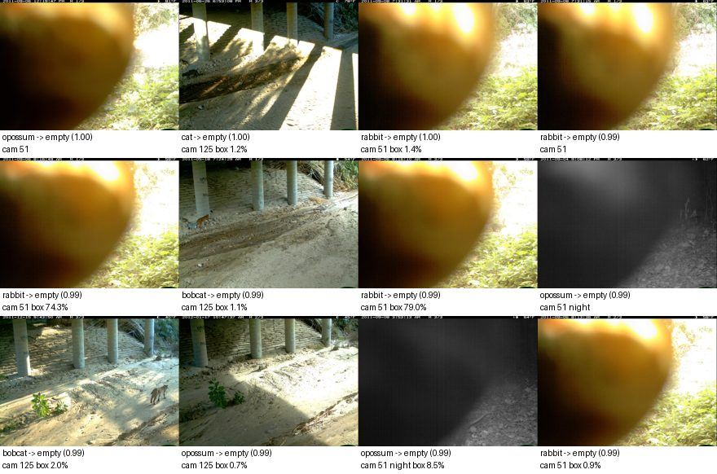
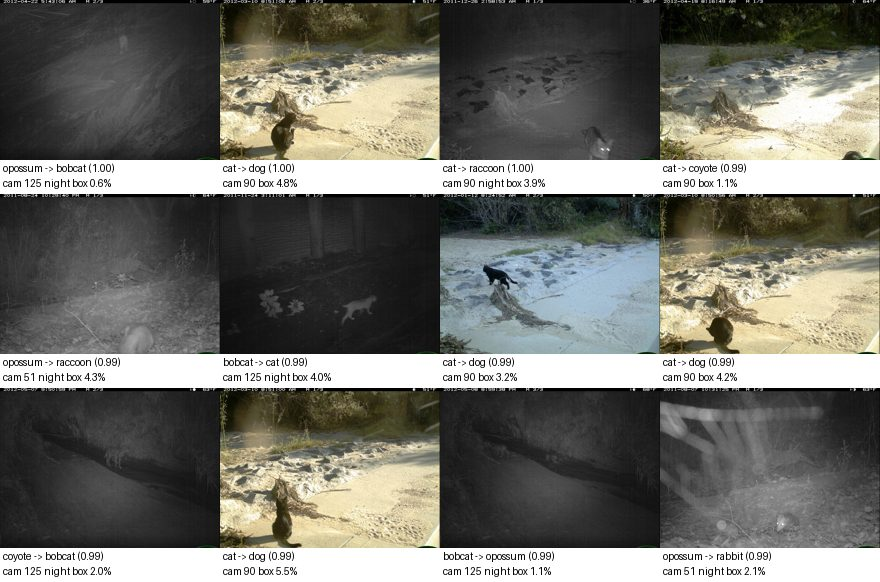
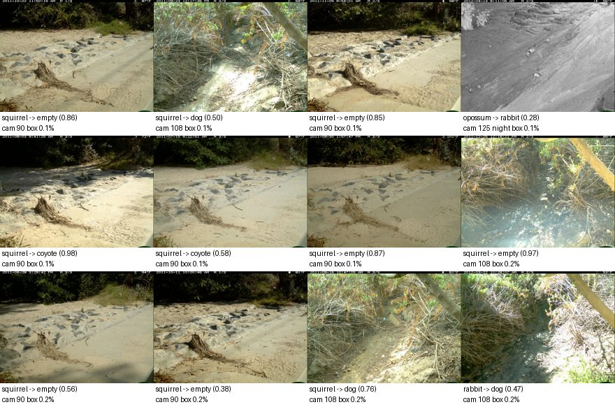
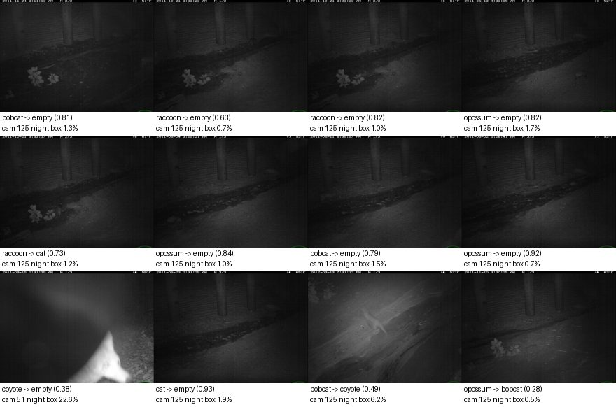
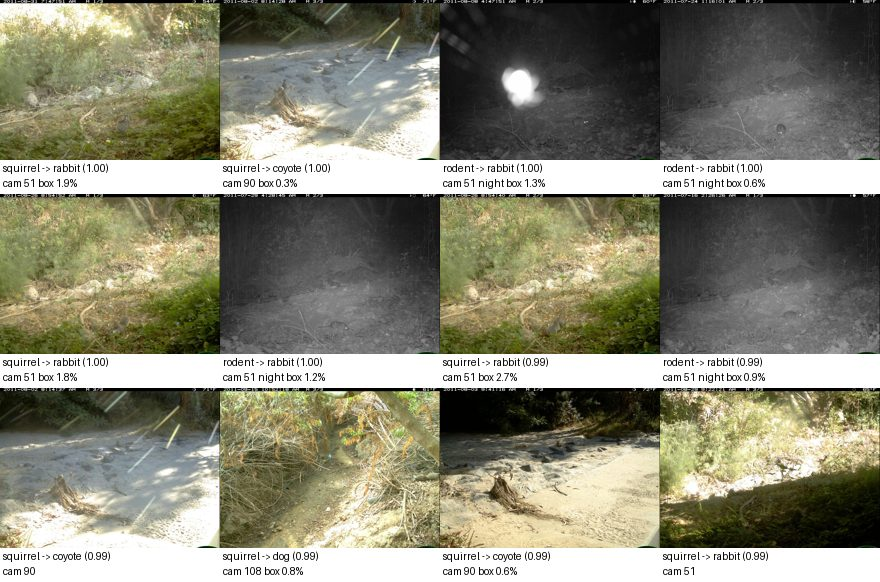

# Model report: `finetune-e3-deep-balanced`

E3: fine-tune blocks 3-8 + head; class-balanced sampling; flip + box-safe crop. Development partitions only; **the locked final test was not opened.**

## Headline (unseen cameras: calibration + policy validation)

| Metric | Value |
|---|---|
| Macro-F1, supported classes (image level) | 0.413 |
| Lowest per-species recall | 0.163 |
| Animal events wrongly filtered as empty, at reference thresholds | 57 of 1577 (3.61% [2.8, 4.7]) |
| Events left for review at reference thresholds | 77.6% |

Reference thresholds P(empty) >= 0.9, species >= 0.9 are **reference points, not chosen operating points**; scores are uncalibrated. Thresholds are chosen later on policy validation.

Overall accuracy (46.4%) is **not** a headline metric: a model can score well by predicting the most common classes while missing animals. Macro-F1 weights every class equally; the false-empty count measures the failure that matters most.

## Seen vs unseen cameras

Same model; the diagnostic partition holds out sequences from *training* cameras.

| Partition | Cameras | Images | Macro-F1 | Min species recall | Animal image recall | False-empty events (ref) |
|---|---|---|---|---|---|---|
| unseen_cameras | unseen | 4336 | 0.413 | 0.163 | 75.5% | 57 / 1577 |
| calibration | unseen | 2032 | 0.452 | 0.326 | 81.4% | 44 / 724 |
| policy_validation | unseen | 2304 | 0.382 | 0.143 | 71.2% | 13 / 853 |
| seen_camera_diagnostic | seen (training) | 3568 | 0.747 | 0.719 | 93.2% | 19 / 1441 |

## Image level, unseen cameras

| Class | Precision | Recall | F1 | Support | Predicted |
|---|---|---|---|---|---|
| empty | 0.335 | 0.695 | 0.452 | 652 | 1354 |
| bobcat | 0.771 | 0.489 | 0.599 | 1049 | 665 |
| cat | 0.189 | 0.163 | 0.175 | 363 | 312 |
| coyote | 0.366 | 0.419 | 0.390 | 289 | 331 |
| dog | 0.233 | 0.570 | 0.330 | 135 | 331 |
| opossum | 0.823 | 0.436 | 0.570 | 1197 | 634 |
| rabbit | 0.346 | 0.431 | 0.384 | 327 | 407 |
| raccoon | 0.417 | 0.389 | 0.403 | 324 | 302 |

Confusion matrix (rows = true, columns = predicted):

|  | empty | bobcat | cat | coyote | dog | opossum | rabbit | raccoon |
|---|---|---|---|---|---|---|---|---|
| empty | 453 | 2 | 36 | 43 | 76 | 4 | 27 | 11 |
| bobcat | 245 | 513 | 78 | 47 | 15 | 31 | 86 | 34 |
| cat | 113 | 15 | 59 | 47 | 42 | 31 | 11 | 45 |
| coyote | 73 | 27 | 25 | 121 | 10 | 4 | 14 | 15 |
| dog | 13 | 12 | 9 | 7 | 77 | 1 | 11 | 5 |
| opossum | 334 | 71 | 15 | 27 | 84 | 522 | 83 | 61 |
| rabbit | 56 | 12 | 62 | 35 | 11 | 5 | 141 | 5 |
| raccoon | 67 | 13 | 28 | 4 | 16 | 36 | 34 | 126 |

**Unsupported animals** (976 images of species outside the supported set): 123 were given a supported species with confidence >= 0.9. Predicted as: empty 326, rabbit 184, coyote 153, dog 136, cat 89, opossum 46, raccoon 22, bobcat 20.

## Event-level trade-off, unseen cameras

Conservative policy: filter only if **every** frame has P(empty) >= threshold; any animal-looking frame keeps the event; species accepted only if animal frames agree and their mean probability >= species threshold.

Empty threshold sweep (species threshold 0.9):

| P(empty) >= | Filtered | True empty filtered | Animal events filtered (95% CI) | Retention | Review |
|---|---|---|---|---|---|
| 0.5 | 364 / 1847 | 168 / 270 | 196 (12.43% [10.9, 14.1]) | 87.57% | 67.6% |
| 0.7 | 267 / 1847 | 145 / 270 | 122 (7.74% [6.5, 9.2]) | 92.26% | 72.9% |
| 0.8 | 223 / 1847 | 132 / 270 | 91 (5.77% [4.7, 7.0]) | 94.23% | 75.3% |
| 0.9 | 179 / 1847 | 122 / 270 | 57 (3.61% [2.8, 4.7]) | 96.39% | 77.6% |
| 0.95 | 145 / 1847 | 102 / 270 | 43 (2.73% [2.0, 3.7]) | 97.27% | 79.5% |
| 0.99 | 65 / 1847 | 48 / 270 | 17 (1.08% [0.7, 1.7]) | 98.92% | 83.8% |

Species threshold sweep (empty threshold 0.9):

| Species >= | Accepted | Precision (95% CI) | Wrong by true role | Unsupported accepted as known | Review |
|---|---|---|---|---|---|
| 0.5 | 725 / 1847 | 54.5% [50.8, 58.1] | other_supported_species 137, unsupported_animal 137, empty 44, mixed_species 12 | 137 | 51.1% |
| 0.7 | 506 / 1847 | 63.0% [58.8, 67.1] | unsupported_animal 83, other_supported_species 81, empty 14, mixed_species 9 | 83 | 62.9% |
| 0.8 | 366 / 1847 | 63.1% [58.1, 67.9] | unsupported_animal 66, other_supported_species 54, empty 8, mixed_species 7 | 66 | 70.5% |
| 0.9 | 234 / 1847 | 69.7% [63.5, 75.2] | unsupported_animal 34, other_supported_species 29, empty 4, mixed_species 4 | 34 | 77.6% |
| 0.95 | 145 / 1847 | 75.9% [68.3, 82.1] | unsupported_animal 16, other_supported_species 15, empty 2, mixed_species 2 | 16 | 82.5% |
| 0.99 | 51 / 1847 | 88.2% [76.6, 94.5] | other_supported_species 5, empty 1 | 0 | 87.5% |

## Slices, unseen cameras

Event false-empty counts at the reference thresholds. Night = most frames are grayscale infrared.

| Camera | Images | Macro-F1 | Animal image recall | False-empty events |
|---|---|---|---|---|
| 108 | 756 | 0.325 | 80.4% | 1 / 328 |
| 125 | 1594 | 0.374 | 71.2% | 7 / 556 |
| 51 | 1276 | 0.531 | 82.1% | 43 / 396 |
| 90 | 710 | 0.353 | 71.2% | 6 / 297 |

| Condition | Images | Macro-F1 | Animal image recall | False-empty events |
|---|---|---|---|---|
| day | 1308 | 0.394 | 75.7% | 38 / 549 |
| night | 3028 | 0.356 | 75.5% | 19 / 1028 |

## Why each false-empty event was filtered

Every animal event the reference policy would drop, with each frame's P(empty); all frames were above the threshold, which is the only way the conservative policy filters an event.

| Event | Camera | True label | Role | Frame P(empty) |
|---|---|---|---|---|
| 6f0f8619 | 90 | squirrel | unsupported_animal | 0.952, 0.933, 0.932 |
| 6f0f867a | 90 | squirrel | unsupported_animal | 0.944, 0.940, 0.950 |
| 6f0f86d4 | 90 | squirrel | unsupported_animal | 0.943, 0.953, 0.944 |
| 6f0f8730 | 90 | squirrel | unsupported_animal | 0.933, 0.917, 0.927 |
| 6f0f8794 | 90 | squirrel | unsupported_animal | 0.933, 0.936, 0.932 |
| 6f0f87ee | 90 | squirrel | unsupported_animal | 0.960, 0.957, 0.969 |
| 6f150570 | 108 | squirrel | unsupported_animal | 0.977, 0.972, 0.981 |
| 6f15a407 | 125 | bobcat | supported_species | 0.947, 0.941, 0.934 |
| 6f15adb8 | 125 | bobcat | supported_species | 0.912, 0.955, 0.947 |
| 6f15af40 | 125 | bobcat | supported_species | 0.933, 0.949, 0.955 |
| 6f15af8c | 125 | bobcat | supported_species | 0.993, 0.964, 0.900 |
| 6f15c96b | 125 | cat | supported_species | 0.998, 0.997, 0.998 |
| 6f15ff51 | 125 | bobcat | supported_species | 0.987, 0.987, 0.985 |
| 6f1604ab | 125 | opossum | supported_species | 0.990, 0.991, 0.985 |
| 6f1cc291 | 51 | squirrel | unsupported_animal | 0.995, 0.999, 1.000 |
| 6f1cc2e1 | 51 | squirrel | unsupported_animal | 0.999, 0.999, 0.999 |
| 6f1cc4f3 | 51 | opossum | supported_species | 0.973, 0.980, 0.953 |
| 6f1cc5d1 | 51 | opossum | supported_species | 0.979, 0.983, 0.992 |
| 6f1cc670 | 51 | opossum | supported_species | 0.975, 0.987, 0.980 |
| 6f1ccaba | 51 | squirrel | unsupported_animal | 0.998, 0.996, 0.996 |
| 6f1ccb00 | 51 | squirrel | unsupported_animal | 0.991, 0.991, 0.996 |
| 6f1ccb51 | 51 | squirrel | unsupported_animal | 0.995, 0.995, 0.992 |
| 6f1ccbe8 | 51 | squirrel | unsupported_animal | 0.991, 0.991, 0.989 |
| 6f1ccc38 | 51 | rabbit | supported_species | 0.989, 0.991, 0.990 |
| 6f1ccc7d | 51 | rabbit | supported_species | 0.986, 0.986, 0.992 |
| 6f1ccccc | 51 | rabbit | supported_species | 0.993, 0.992, 0.993 |
| 6f1ccd1e | 51 | opossum | supported_species | 0.999, 0.998, 0.998 |
| 6f1ccdab | 51 | squirrel | unsupported_animal | 0.993, 0.992, 0.997 |
| 6f1ccdfa | 51 | squirrel | unsupported_animal | 0.993, 0.993, 0.996 |
| 6f1cd0a1 | 51 | opossum | supported_species | 0.978, 0.990, 0.991 |
| 6f1cd140 | 51 | squirrel | unsupported_animal | 0.998, 0.997, 0.997 |
| 6f1cd1d7 | 51 | rabbit | supported_species | 0.994, 0.993, 0.993 |
| 6f1cd21e | 51 | rabbit | supported_species | 0.995, 0.993, 0.995 |
| 6f1cd2b5 | 51 | opossum | supported_species | 0.969, 0.972, 0.975 |
| 6f1cd430 | 51 | rabbit | supported_species | 0.960, 0.951, 0.900 |
| 6f1cd475 | 51 | rabbit | supported_species | 0.976, 0.975, 0.970 |
| 6f1cd4c5 | 51 | squirrel | unsupported_animal | 0.994, 0.995, 0.996 |
| 6f1cd517 | 51 | squirrel | unsupported_animal | 0.993, 0.992, 0.990 |
| 6f1cd55c | 51 | squirrel | unsupported_animal | 0.949, 0.991, 0.975 |
| 6f1cd5ab | 51 | squirrel | unsupported_animal | 0.983, 0.977, 0.981 |

...and 17 more in `eval/events.jsonl.gz`.

## Inference time and memory

Declared hardware: Apple M1, 8 GB RAM, macOS-26.6.2-arm64-arm-64bit, torch 2.14.0 (4 threads), device `mps`.

| Stage | Images | Seconds | Images/s | Peak RSS, main process (MB) |
|---|---|---|---|---|
| calibration | 2641 | 38.13 | 69.27 | 354.9 |
| policy_validation | 2732 | 39.1 | 69.87 | 354.9 |
| seen_camera_diagnostic | 4313 | 55.16 | 78.19 | 354.9 |

Single image end to end (decode, preprocess, embed, classify; batch size 1, after warm-up). The Docker deployment runs on CPU.

| Device | Images | p50 ms | p95 ms | Peak RSS, main process (MB) |
|---|---|---|---|---|
| mps | 32 | 20 | 20 | 473 |
| cpu | 32 | 132 | 146 | 492 |

## Error gallery

From the unseen-camera development partitions. Captions: true label -> predicted (confidence), camera, night flag.

### False empty (901 images, 442 events)

Animals predicted empty (highest P(empty) first). These frames are what the empty filter would drop.



<details><summary>Examples</summary>

| Image | Event | Camera | True | Predicted | Conf. | Night | Blur | Box area |
|---|---|---|---|---|---|---|---|---|
| 59b131bd | 6f1ccd1e | 51 | opossum | empty | 1.00 |  | 1048 | n/a |
| 58ec5733 | 6f15c96b | 125 | cat | empty | 1.00 |  | 1293 | 1.2% |
| 59c31b79 | 6f1cd21e | 51 | rabbit | empty | 1.00 |  | 977 | 1.4% |
| 599be822 | 6f1cd1d7 | 51 | rabbit | empty | 0.99 |  | 978 | n/a |
| 5a1309a6 | 6f1ccccc | 51 | rabbit | empty | 0.99 |  | 1021 | 74.3% |
| 58a8a250 | 6f15af8c | 125 | bobcat | empty | 0.99 |  | 1429 | 1.1% |
| 5a2af560 | 6f1ccc7d | 51 | rabbit | empty | 0.99 |  | 1022 | 79.0% |
| 59e77e79 | 6f1cc5d1 | 51 | opossum | empty | 0.99 | yes | 386 | n/a |
| 587b7e17 | 6f15ff02 | 125 | bobcat | empty | 0.99 |  | 2080 | 2.0% |
| 5906f03b | 6f1604ab | 125 | opossum | empty | 0.99 |  | 1743 | 0.7% |
| 59bfdedb | 6f1cd00a | 51 | opossum | empty | 0.99 | yes | 345 | 8.5% |
| 598c5cfe | 6f1ccc38 | 51 | rabbit | empty | 0.99 |  | 990 | 0.9% |

</details>

### Confused species (1224 images, 631 events)

Supported species predicted as another species (most confident mistakes first).



<details><summary>Examples</summary>

| Image | Event | Camera | True | Predicted | Conf. | Night | Blur | Box area |
|---|---|---|---|---|---|---|---|---|
| 58a37ae9 | 6f1642a1 | 125 | opossum | bobcat | 1.00 | yes | 329 | 0.6% |
| 58d2eb1e | 6f0fb2c0 | 90 | cat | dog | 1.00 |  | 1874 | 4.8% |
| 58c662bd | 6f0f9747 | 90 | cat | raccoon | 1.00 | yes | 348 | 3.9% |
| 594843e8 | 6f0fbd68 | 90 | cat | coyote | 0.99 |  | 1423 | 1.1% |
| 5a2e1250 | 6f1ca58c | 51 | opossum | raccoon | 0.99 | yes | 512 | 4.3% |
| 58eac81c | 6f15fd2b | 125 | bobcat | cat | 0.99 | yes | 291 | 4.0% |
| 586c88c4 | 6f0f9ce8 | 90 | cat | dog | 0.99 |  | 930 | 3.2% |
| 58e597c7 | 6f0fb20a | 90 | cat | dog | 0.99 |  | 1896 | 4.2% |
| 58bea511 | 6f16644c | 125 | coyote | bobcat | 0.99 | yes | 353 | 2.0% |
| 58ac0d27 | 6f0fb259 | 90 | cat | dog | 0.99 |  | 1868 | 5.5% |
| 587184d1 | 6f16676b | 125 | bobcat | opossum | 0.99 | yes | 329 | 1.1% |
| 599bea78 | 6f1ca328 | 51 | opossum | rabbit | 0.99 | yes | 487 | 2.1% |

</details>

### Small animals (634 images, 347 events)

Misclassified animals whose largest box covers < 1% of the frame.



<details><summary>Examples</summary>

| Image | Event | Camera | True | Predicted | Conf. | Night | Blur | Box area |
|---|---|---|---|---|---|---|---|---|
| 592c4e9f | 6f0f7ca3 | 90 | squirrel | empty | 0.86 |  | 1277 | 0.1% |
| 587680f6 | 6f14f8d1 | 108 | squirrel | dog | 0.50 |  | 3875 | 0.1% |
| 58ede390 | 6f0f8559 | 90 | squirrel | empty | 0.85 |  | 1883 | 0.1% |
| 593a4e63 | 6f163b47 | 125 | opossum | rabbit | 0.28 | yes | 969 | 0.1% |
| 59484629 | 6f0f6ff0 | 90 | squirrel | coyote | 0.98 |  | 1791 | 0.1% |
| 591fd1bd | 6f0f6aa1 | 90 | squirrel | coyote | 0.58 |  | 881 | 0.1% |
| 58a37ccf | 6f0f7857 | 90 | squirrel | empty | 0.87 |  | 811 | 0.1% |
| 59484744 | 6f150570 | 108 | squirrel | empty | 0.97 |  | 2555 | 0.2% |
| 593d68d7 | 6f0f6778 | 90 | squirrel | empty | 0.56 |  | 986 | 0.2% |
| 5938c325 | 6f0f7a75 | 90 | squirrel | empty | 0.38 |  | 1659 | 0.2% |
| 58b9d6d4 | 6f14ee78 | 108 | squirrel | dog | 0.76 |  | 3670 | 0.2% |
| 58eac904 | 6f151380 | 108 | rabbit | dog | 0.47 |  | 4686 | 0.2% |

</details>

### Blurred (331 images, 157 events)

Misclassified images in the blurriest 10% (variance of Laplacian < 338).



<details><summary>Examples</summary>

| Image | Event | Camera | True | Predicted | Conf. | Night | Blur | Box area |
|---|---|---|---|---|---|---|---|---|
| 58bb8c53 | 6f15fd2b | 125 | bobcat | empty | 0.81 | yes | 288 | 1.3% |
| 5911d7e6 | 6f15f726 | 125 | raccoon | empty | 0.63 | yes | 299 | 0.7% |
| 5935a620 | 6f15f6d9 | 125 | raccoon | empty | 0.82 | yes | 299 | 1.0% |
| 585c048c | 6f15ae57 | 125 | opossum | empty | 0.82 | yes | 300 | 1.7% |
| 58823c6c | 6f15f687 | 125 | raccoon | cat | 0.73 | yes | 303 | 1.2% |
| 588f6805 | 6f15b7de | 125 | opossum | empty | 0.84 | yes | 303 | 1.0% |
| 5887187d | 6f15c135 | 125 | bobcat | empty | 0.79 | yes | 303 | 1.5% |
| 588c14b3 | 6f15ab87 | 125 | opossum | empty | 0.92 | yes | 303 | 0.7% |
| 5989433e | 6f1ce43d | 51 | coyote | empty | 0.38 | yes | 303 | 22.6% |
| 58e0f61c | 6f15c828 | 125 | cat | empty | 0.93 | yes | 305 | 1.9% |
| 58eac848 | 6f161c57 | 125 | bobcat | coyote | 0.49 | yes | 305 | 6.2% |
| 58c7ef8b | 6f15fb05 | 125 | opossum | bobcat | 0.28 | yes | 306 | 0.5% |

</details>

### Unfamiliar inputs (650 images, 245 events)

Unsupported animals labeled as a supported species (most confident first). Confidence alone does not reject them.



<details><summary>Examples</summary>

| Image | Event | Camera | True | Predicted | Conf. | Night | Blur | Box area |
|---|---|---|---|---|---|---|---|---|
| 5a116c81 | 6f1cb778 | 51 | squirrel | rabbit | 1.00 |  | 1590 | 1.9% |
| 58ede1df | 6f0f6e30 | 90 | squirrel | coyote | 1.00 |  | 1048 | 0.3% |
| 59bca48c | 6f1ca37a | 51 | rodent | rabbit | 1.00 | yes | 379 | 1.3% |
| 5973896d | 6f1c8c59 | 51 | rodent | rabbit | 1.00 | yes | 508 | 0.6% |
| 596bd939 | 6f1ca919 | 51 | squirrel | rabbit | 1.00 |  | 1565 | 1.8% |
| 59a17aff | 6f1c9505 | 51 | rodent | rabbit | 1.00 | yes | 484 | 1.2% |
| 5a1fe745 | 6f1ca8ca | 51 | squirrel | rabbit | 0.99 |  | 1582 | 2.7% |
| 599fbe1c | 6f1c79e8 | 51 | rodent | rabbit | 0.99 | yes | 472 | 0.9% |
| 58d47c8e | 6f0f6e94 | 90 | squirrel | coyote | 0.99 |  | 1050 | n/a |
| 591995a7 | 6f14ed2e | 108 | squirrel | dog | 0.99 |  | 3738 | 0.8% |
| 5922ed57 | 6f0f6f99 | 90 | squirrel | coyote | 0.99 |  | 1798 | 0.6% |
| 596bd79b | 6f1cb019 | 51 | squirrel | rabbit | 0.99 |  | 2604 | n/a |

</details>

## Setup and reproduction

|  |  |
|---|---|
| Training images (use_for_fit) | 20287: bobcat 1331, cat 2428, coyote 2367, dog 1531, empty 1318, opossum 5947, rabbit 3638, raccoon 1727 |
| Pretrained weights | EfficientNet_B0_Weights.IMAGENET1K_V1 (ImageNet-1k; not wildlife-specific, so no overlap with CCT20) https://download.pytorch.org/models/efficientnet_b0_rwightman-7f5810bc.pth |
| Fine-tuning | blocks >= 3 + head, balanced_sampling, 3 epochs, lr 0.0003, batch 32, photometric augmentation False |
| Trained on | partitions ['train'] only; image-id digest `feb80b9a059fce5f` |
| Training time | 4202 s on mps |
| Split / inventory | `cct20-splits-v1-7de740aba75f` / `cct20-396eb43cc6ce` |
| Preprocessing | `6d9a950a6543` |
| Seed | 20260924 |
| Code | `7d4a38898d256aac6cd446895d005624ea567a7e` |
| MLflow run | `b57ee7aa105949519561a99c78bca741` |

```bash
uv run wildinbox finetune train --config configs/experiments/finetune-e3-deep-balanced.yaml
uv run wildinbox evaluate --model models/finetune-e3-deep-balanced --report-dir reports/experiments/finetune-e3-deep-balanced
```

## Limitations

- Scores are uncalibrated; thresholds above are reference points only.
- Unseen-camera results rest on 4 development cameras; see the per-camera table.
- CCT20 is ~7% empty, so empty-filtering volume here understates a real memory card.
- Day/night is inferred from grayscale (infrared) frames, not from timestamps.
