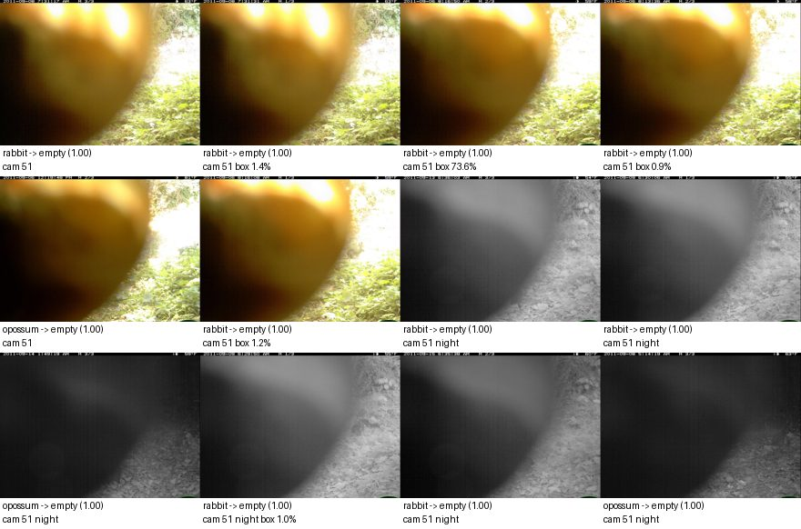
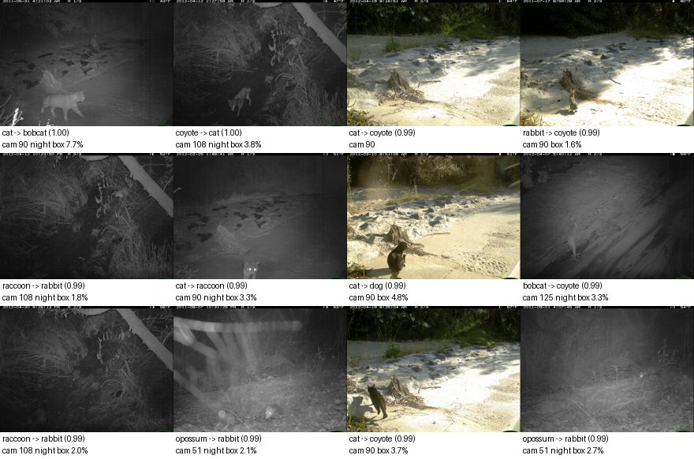
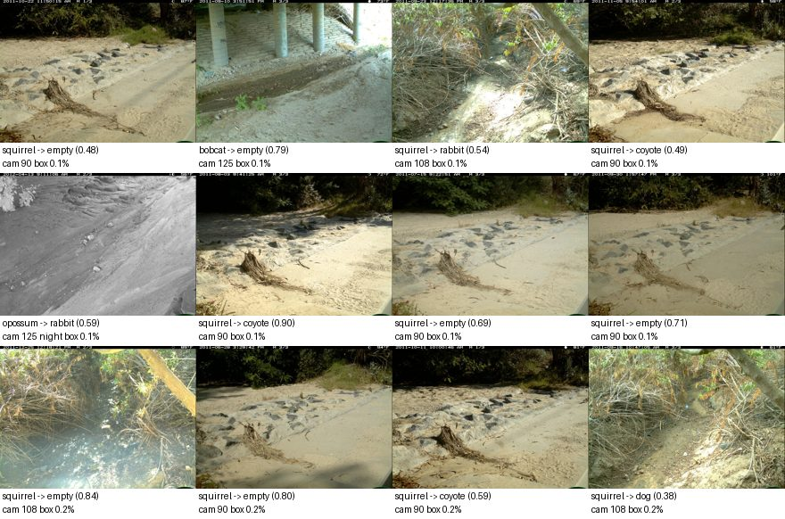
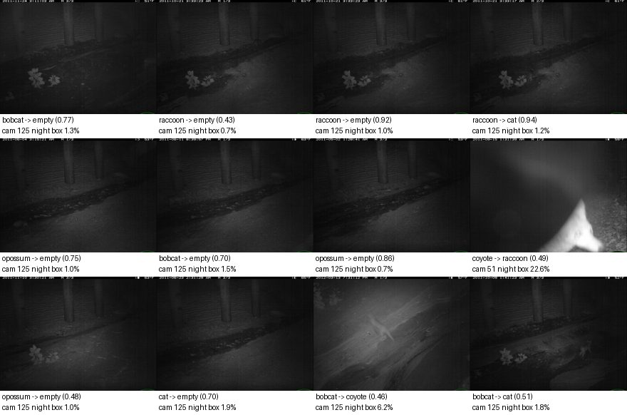
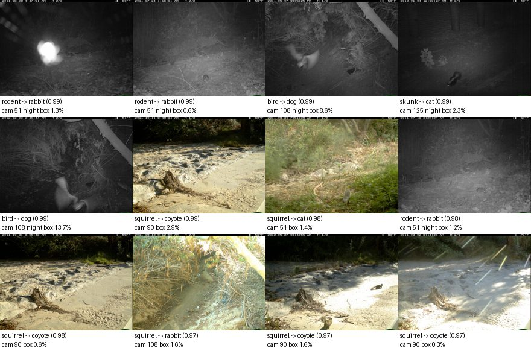

# Model report: `finetune-e4-deep-lossweight-photo`

E4: fine-tune blocks 3-8 + head; class-weighted loss; flip + box-safe crop + photometric. Development partitions only; **the locked final test was not opened.**

## Headline (unseen cameras: calibration + policy validation)

| Metric | Value |
|---|---|
| Macro-F1, supported classes (image level) | 0.383 |
| Lowest per-species recall | 0.083 |
| Animal events wrongly filtered as empty, at reference thresholds | 49 of 1577 (3.11% [2.4, 4.1]) |
| Events left for review at reference thresholds | 78.9% |

Reference thresholds P(empty) >= 0.9, species >= 0.9 are **reference points, not chosen operating points**; scores are uncalibrated. Thresholds are chosen later on policy validation.

Overall accuracy (44.4%) is **not** a headline metric: a model can score well by predicting the most common classes while missing animals. Macro-F1 weights every class equally; the false-empty count measures the failure that matters most.

## Seen vs unseen cameras

Same model; the diagnostic partition holds out sequences from *training* cameras.

| Partition | Cameras | Images | Macro-F1 | Min species recall | Animal image recall | False-empty events (ref) |
|---|---|---|---|---|---|---|
| unseen_cameras | unseen | 4336 | 0.383 | 0.083 | 71.4% | 49 / 1577 |
| calibration | unseen | 2032 | 0.416 | 0.188 | 80.2% | 47 / 724 |
| policy_validation | unseen | 2304 | 0.358 | 0.083 | 65.0% | 2 / 853 |
| seen_camera_diagnostic | seen (training) | 3568 | 0.749 | 0.707 | 88.6% | 18 / 1441 |

## Image level, unseen cameras

| Class | Precision | Recall | F1 | Support | Predicted |
|---|---|---|---|---|---|
| empty | 0.325 | 0.779 | 0.459 | 652 | 1562 |
| bobcat | 0.793 | 0.505 | 0.617 | 1049 | 668 |
| cat | 0.129 | 0.083 | 0.101 | 363 | 233 |
| coyote | 0.267 | 0.526 | 0.354 | 289 | 570 |
| dog | 0.207 | 0.504 | 0.294 | 135 | 328 |
| opossum | 0.891 | 0.361 | 0.514 | 1197 | 485 |
| rabbit | 0.337 | 0.343 | 0.340 | 327 | 332 |
| raccoon | 0.589 | 0.287 | 0.386 | 324 | 158 |

Confusion matrix (rows = true, columns = predicted):

|  | empty | bobcat | cat | coyote | dog | opossum | rabbit | raccoon |
|---|---|---|---|---|---|---|---|---|
| empty | 508 | 7 | 10 | 49 | 58 | 0 | 19 | 1 |
| bobcat | 245 | 530 | 65 | 131 | 28 | 11 | 34 | 5 |
| cat | 127 | 27 | 30 | 91 | 43 | 12 | 4 | 29 |
| coyote | 81 | 16 | 16 | 152 | 10 | 0 | 10 | 4 |
| dog | 14 | 20 | 14 | 9 | 68 | 1 | 9 | 0 |
| opossum | 424 | 49 | 10 | 66 | 79 | 432 | 112 | 25 |
| rabbit | 78 | 9 | 47 | 55 | 23 | 2 | 112 | 1 |
| raccoon | 85 | 10 | 41 | 17 | 19 | 27 | 32 | 93 |

**Unsupported animals** (976 images of species outside the supported set): 63 were given a supported species with confidence >= 0.9. Predicted as: empty 375, coyote 198, rabbit 160, dog 146, cat 51, opossum 34, bobcat 9, raccoon 3.

## Event-level trade-off, unseen cameras

Conservative policy: filter only if **every** frame has P(empty) >= threshold; any animal-looking frame keeps the event; species accepted only if animal frames agree and their mean probability >= species threshold.

Empty threshold sweep (species threshold 0.9):

| P(empty) >= | Filtered | True empty filtered | Animal events filtered (95% CI) | Retention | Review |
|---|---|---|---|---|---|
| 0.5 | 371 / 1847 | 181 / 270 | 190 (12.05% [10.5, 13.7]) | 87.95% | 67.9% |
| 0.7 | 245 / 1847 | 144 / 270 | 101 (6.40% [5.3, 7.7]) | 93.60% | 74.7% |
| 0.8 | 199 / 1847 | 129 / 270 | 70 (4.44% [3.5, 5.6]) | 95.56% | 77.2% |
| 0.9 | 167 / 1847 | 118 / 270 | 49 (3.11% [2.4, 4.1]) | 96.89% | 78.9% |
| 0.95 | 159 / 1847 | 113 / 270 | 46 (2.92% [2.2, 3.9]) | 97.08% | 79.4% |
| 0.99 | 114 / 1847 | 82 / 270 | 32 (2.03% [1.4, 2.9]) | 97.97% | 81.8% |

Species threshold sweep (empty threshold 0.9):

| Species >= | Accepted | Precision (95% CI) | Wrong by true role | Unsupported accepted as known | Review |
|---|---|---|---|---|---|
| 0.5 | 780 / 1847 | 52.3% [48.8, 55.8] | other_supported_species 189, unsupported_animal 138, empty 31, mixed_species 14 | 138 | 48.7% |
| 0.7 | 508 / 1847 | 65.9% [61.7, 69.9] | other_supported_species 92, unsupported_animal 67, empty 9, mixed_species 5 | 67 | 63.5% |
| 0.8 | 378 / 1847 | 73.8% [69.2, 78.0] | other_supported_species 53, unsupported_animal 38, mixed_species 5, empty 3 | 38 | 70.5% |
| 0.9 | 222 / 1847 | 80.6% [74.9, 85.3] | other_supported_species 19, unsupported_animal 19, mixed_species 3, empty 2 | 19 | 78.9% |
| 0.95 | 139 / 1847 | 84.2% [77.2, 89.3] | other_supported_species 9, unsupported_animal 9, empty 2, mixed_species 2 | 9 | 83.4% |
| 0.99 | 29 / 1847 | 89.7% [73.6, 96.4] | other_supported_species 2, unsupported_animal 1 | 1 | 89.4% |

## Slices, unseen cameras

Event false-empty counts at the reference thresholds. Night = most frames are grayscale infrared.

| Camera | Images | Macro-F1 | Animal image recall | False-empty events |
|---|---|---|---|---|
| 108 | 756 | 0.265 | 79.0% | 0 / 328 |
| 125 | 1594 | 0.359 | 64.1% | 2 / 556 |
| 51 | 1276 | 0.504 | 80.9% | 47 / 396 |
| 90 | 710 | 0.315 | 67.2% | 0 / 297 |

| Condition | Images | Macro-F1 | Animal image recall | False-empty events |
|---|---|---|---|---|
| day | 1308 | 0.373 | 74.4% | 28 / 549 |
| night | 3028 | 0.321 | 70.4% | 21 / 1028 |

## Why each false-empty event was filtered

Every animal event the reference policy would drop, with each frame's P(empty); all frames were above the threshold, which is the only way the conservative policy filters an event.

| Event | Camera | True label | Role | Frame P(empty) |
|---|---|---|---|---|
| 6f15a407 | 125 | bobcat | supported_species | 0.917, 0.911, 0.905 |
| 6f15adb8 | 125 | bobcat | supported_species | 0.959, 0.957, 0.959 |
| 6f1cba4a | 51 | rabbit | supported_species | 0.944, 0.943, 0.946 |
| 6f1cc291 | 51 | squirrel | unsupported_animal | 1.000, 1.000, 1.000 |
| 6f1cc2e1 | 51 | squirrel | unsupported_animal | 1.000, 1.000, 1.000 |
| 6f1cc4f3 | 51 | opossum | supported_species | 0.987, 0.993, 0.979 |
| 6f1cc5d1 | 51 | opossum | supported_species | 0.983, 0.993, 0.994 |
| 6f1cc670 | 51 | opossum | supported_species | 0.976, 0.988, 0.987 |
| 6f1ccaba | 51 | squirrel | unsupported_animal | 1.000, 1.000, 1.000 |
| 6f1ccb00 | 51 | squirrel | unsupported_animal | 1.000, 1.000, 1.000 |
| 6f1ccb51 | 51 | squirrel | unsupported_animal | 1.000, 1.000, 1.000 |
| 6f1ccbe8 | 51 | squirrel | unsupported_animal | 1.000, 1.000, 1.000 |
| 6f1ccc38 | 51 | rabbit | supported_species | 1.000, 1.000, 1.000 |
| 6f1ccc7d | 51 | rabbit | supported_species | 1.000, 1.000, 1.000 |
| 6f1ccccc | 51 | rabbit | supported_species | 1.000, 1.000, 1.000 |
| 6f1ccd1e | 51 | opossum | supported_species | 1.000, 1.000, 1.000 |
| 6f1ccdab | 51 | squirrel | unsupported_animal | 1.000, 1.000, 1.000 |
| 6f1ccdfa | 51 | squirrel | unsupported_animal | 1.000, 1.000, 1.000 |
| 6f1cd0a1 | 51 | opossum | supported_species | 0.989, 0.994, 0.995 |
| 6f1cd140 | 51 | squirrel | unsupported_animal | 1.000, 1.000, 1.000 |
| 6f1cd187 | 51 | squirrel | unsupported_animal | 0.932, 0.998, 1.000 |
| 6f1cd1d7 | 51 | rabbit | supported_species | 1.000, 1.000, 1.000 |
| 6f1cd21e | 51 | rabbit | supported_species | 1.000, 1.000, 1.000 |
| 6f1cd2b5 | 51 | opossum | supported_species | 0.986, 0.980, 0.978 |
| 6f1cd430 | 51 | rabbit | supported_species | 0.998, 0.997, 0.996 |
| 6f1cd475 | 51 | rabbit | supported_species | 0.999, 0.998, 0.997 |
| 6f1cd4c5 | 51 | squirrel | unsupported_animal | 1.000, 1.000, 1.000 |
| 6f1cd517 | 51 | squirrel | unsupported_animal | 1.000, 1.000, 1.000 |
| 6f1cd55c | 51 | squirrel | unsupported_animal | 0.999, 0.999, 0.999 |
| 6f1cd5ab | 51 | squirrel | unsupported_animal | 1.000, 1.000, 1.000 |
| 6f1cd5f3 | 51 | opossum | supported_species | 0.978, 0.978, 0.980 |
| 6f1cd78c | 51 | squirrel | unsupported_animal | 1.000, 1.000, 1.000 |
| 6f1cd930 | 51 | squirrel | unsupported_animal | 0.996, 0.997, 0.998 |
| 6f1cdb91 | 51 | squirrel | unsupported_animal | 0.999, 0.999, 0.999 |
| 6f1cdbd7 | 51 | opossum | supported_species | 0.986, 0.990, 0.986 |
| 6f1cdc28 | 51 | coyote | supported_species | 0.988, 0.989, 0.980 |
| 6f1cdc6e | 51 | coyote | supported_species | 0.991, 0.988, 0.991 |
| 6f1cdcc0 | 51 | coyote | supported_species | 0.986, 0.991, 0.994 |
| 6f1cdd05 | 51 | coyote | supported_species | 0.990, 0.994, 0.986 |
| 6f1cdd4a | 51 | coyote | supported_species | 0.993, 0.990, 0.993 |

...and 9 more in `eval/events.jsonl.gz`.

## Inference time and memory

Declared hardware: Apple M1, 8 GB RAM, macOS-26.6.2-arm64-arm-64bit, torch 2.14.0 (4 threads), device `mps`.

| Stage | Images | Seconds | Images/s | Peak RSS, main process (MB) |
|---|---|---|---|---|
| calibration | 2641 | 37.26 | 70.87 | 460.6 |
| policy_validation | 2732 | 39.44 | 69.28 | 460.6 |
| seen_camera_diagnostic | 4313 | 55.65 | 77.5 | 460.6 |

Single image end to end (decode, preprocess, embed, classify; batch size 1, after warm-up). The Docker deployment runs on CPU.

| Device | Images | p50 ms | p95 ms | Peak RSS, main process (MB) |
|---|---|---|---|---|
| mps | 32 | 20 | 21 | 470 |
| cpu | 32 | 133 | 135 | 486 |

## Error gallery

From the unseen-camera development partitions. Captions: true label -> predicted (confidence), camera, night flag.

### False empty (1054 images, 528 events)

Animals predicted empty (highest P(empty) first). These frames are what the empty filter would drop.



<details><summary>Examples</summary>

| Image | Event | Camera | True | Predicted | Conf. | Night | Blur | Box area |
|---|---|---|---|---|---|---|---|---|
| 5973864d | 6f1cd1d7 | 51 | rabbit | empty | 1.00 |  | 979 | n/a |
| 59c31b79 | 6f1cd21e | 51 | rabbit | empty | 1.00 |  | 977 | 1.4% |
| 59ec5339 | 6f1ccccc | 51 | rabbit | empty | 1.00 |  | 1018 | 73.6% |
| 598c5cfe | 6f1ccc38 | 51 | rabbit | empty | 1.00 |  | 990 | 0.9% |
| 5a0b0240 | 6f1ccd1e | 51 | opossum | empty | 1.00 |  | 1046 | n/a |
| 597fee64 | 6f1ccc7d | 51 | rabbit | empty | 1.00 |  | 1021 | 1.2% |
| 598c5de0 | 6f1cdf5c | 51 | rabbit | empty | 1.00 | yes | 519 | n/a |
| 59ffbcb1 | 6f1cd475 | 51 | rabbit | empty | 1.00 | yes | 520 | n/a |
| 5a1fe81d | 6f1ce042 | 51 | opossum | empty | 1.00 | yes | 355 | n/a |
| 5a2310cd | 6f1cd430 | 51 | rabbit | empty | 1.00 | yes | 516 | 1.0% |
| 5a2c842e | 6f1ce48c | 51 | rabbit | empty | 1.00 | yes | 407 | n/a |
| 59dc25d4 | 6f1cd0a1 | 51 | opossum | empty | 1.00 | yes | 355 | n/a |

</details>

### Confused species (1213 images, 600 events)

Supported species predicted as another species (most confident mistakes first).



<details><summary>Examples</summary>

| Image | Event | Camera | True | Predicted | Conf. | Night | Blur | Box area |
|---|---|---|---|---|---|---|---|---|
| 58732c1b | 6f0f5c2e | 90 | cat | bobcat | 1.00 | yes | 430 | 7.7% |
| 593bde2e | 6f1519a1 | 108 | coyote | cat | 1.00 | yes | 648 | 3.8% |
| 588f67a1 | 6f0fbd68 | 90 | cat | coyote | 0.99 |  | 1422 | n/a |
| 59216379 | 6f0f6afd | 90 | rabbit | coyote | 0.99 |  | 1162 | 1.6% |
| 58cb10e0 | 6f151a40 | 108 | raccoon | rabbit | 0.99 | yes | 665 | 1.8% |
| 58d16149 | 6f0fa7eb | 90 | cat | raccoon | 0.99 | yes | 366 | 3.3% |
| 58d2eb1e | 6f0fb2c0 | 90 | cat | dog | 0.99 |  | 1874 | 4.8% |
| 58c97d5e | 6f163559 | 125 | bobcat | coyote | 0.99 | yes | 364 | 3.3% |
| 58c664a1 | 6f1523fd | 108 | raccoon | rabbit | 0.99 | yes | 634 | 2.0% |
| 599bea78 | 6f1ca328 | 51 | opossum | rabbit | 0.99 | yes | 487 | 2.1% |
| 58af761f | 6f0fbdc0 | 90 | cat | coyote | 0.99 |  | 1603 | 3.7% |
| 597e6293 | 6f1cb95c | 51 | opossum | rabbit | 0.99 | yes | 475 | 2.7% |

</details>

### Small animals (646 images, 353 events)

Misclassified animals whose largest box covers < 1% of the frame.



<details><summary>Examples</summary>

| Image | Event | Camera | True | Predicted | Conf. | Night | Blur | Box area |
|---|---|---|---|---|---|---|---|---|
| 592c4e9f | 6f0f7ca3 | 90 | squirrel | empty | 0.48 |  | 1277 | 0.1% |
| 5876826a | 6f15eae3 | 125 | bobcat | empty | 0.79 |  | 1184 | 0.1% |
| 587680f6 | 6f14f8d1 | 108 | squirrel | rabbit | 0.54 |  | 3875 | 0.1% |
| 58ede390 | 6f0f8559 | 90 | squirrel | coyote | 0.49 |  | 1883 | 0.1% |
| 593a4e63 | 6f163b47 | 125 | opossum | rabbit | 0.59 | yes | 969 | 0.1% |
| 59484629 | 6f0f6ff0 | 90 | squirrel | coyote | 0.90 |  | 1791 | 0.1% |
| 591fd1bd | 6f0f6aa1 | 90 | squirrel | empty | 0.69 |  | 881 | 0.1% |
| 58a37ccf | 6f0f7857 | 90 | squirrel | empty | 0.71 |  | 811 | 0.1% |
| 59484744 | 6f150570 | 108 | squirrel | empty | 0.84 |  | 2555 | 0.2% |
| 593d68d7 | 6f0f6778 | 90 | squirrel | empty | 0.80 |  | 986 | 0.2% |
| 5938c325 | 6f0f7a75 | 90 | squirrel | coyote | 0.59 |  | 1659 | 0.2% |
| 58b9d6d4 | 6f14ee78 | 108 | squirrel | dog | 0.38 |  | 3670 | 0.2% |

</details>

### Blurred (351 images, 161 events)

Misclassified images in the blurriest 10% (variance of Laplacian < 338).



<details><summary>Examples</summary>

| Image | Event | Camera | True | Predicted | Conf. | Night | Blur | Box area |
|---|---|---|---|---|---|---|---|---|
| 58bb8c53 | 6f15fd2b | 125 | bobcat | empty | 0.77 | yes | 288 | 1.3% |
| 5911d7e6 | 6f15f726 | 125 | raccoon | empty | 0.43 | yes | 299 | 0.7% |
| 5935a620 | 6f15f6d9 | 125 | raccoon | empty | 0.92 | yes | 299 | 1.0% |
| 58823c6c | 6f15f687 | 125 | raccoon | cat | 0.94 | yes | 303 | 1.2% |
| 588f6805 | 6f15b7de | 125 | opossum | empty | 0.75 | yes | 303 | 1.0% |
| 5887187d | 6f15c135 | 125 | bobcat | empty | 0.70 | yes | 303 | 1.5% |
| 588c14b3 | 6f15ab87 | 125 | opossum | empty | 0.86 | yes | 303 | 0.7% |
| 5989433e | 6f1ce43d | 51 | coyote | raccoon | 0.49 | yes | 303 | 22.6% |
| 58dc4d3b | 6f15fab5 | 125 | opossum | empty | 0.48 | yes | 305 | 1.0% |
| 58e0f61c | 6f15c828 | 125 | cat | empty | 0.70 | yes | 305 | 1.9% |
| 58eac848 | 6f161c57 | 125 | bobcat | coyote | 0.46 | yes | 305 | 6.2% |
| 58857ddc | 6f15f535 | 125 | bobcat | cat | 0.51 | yes | 305 | 1.8% |

</details>

### Unfamiliar inputs (601 images, 242 events)

Unsupported animals labeled as a supported species (most confident first). Confidence alone does not reject them.



<details><summary>Examples</summary>

| Image | Event | Camera | True | Predicted | Conf. | Night | Blur | Box area |
|---|---|---|---|---|---|---|---|---|
| 59bca48c | 6f1ca37a | 51 | rodent | rabbit | 0.99 | yes | 379 | 1.3% |
| 5973896d | 6f1c8c59 | 51 | rodent | rabbit | 0.99 | yes | 508 | 0.6% |
| 58c03659 | 6f14bdb8 | 108 | bird | dog | 0.99 | yes | 641 | 8.6% |
| 58cb135f | 6f160219 | 125 | skunk | cat | 0.99 | yes | 324 | 2.3% |
| 58732ddd | 6f150c1e | 108 | bird | dog | 0.99 | yes | 615 | 13.7% |
| 58eac99a | 6f0f7a19 | 90 | squirrel | coyote | 0.99 |  | 2402 | 2.9% |
| 5a2af5f8 | 6f1cb43a | 51 | squirrel | cat | 0.98 |  | 1370 | 1.4% |
| 59d0e4ee | 6f1c79e8 | 51 | rodent | rabbit | 0.98 | yes | 478 | 1.2% |
| 58b2ee4e | 6f0f8094 | 90 | squirrel | coyote | 0.98 |  | 2184 | 0.6% |
| 58a8a0d3 | 6f14eb45 | 108 | squirrel | rabbit | 0.97 |  | 2635 | 1.6% |
| 587186b0 | 6f0fcb30 | 90 | squirrel | coyote | 0.97 |  | 1653 | 1.6% |
| 5897b169 | 6f0f6e94 | 90 | squirrel | coyote | 0.97 |  | 1050 | 0.3% |

</details>

## Setup and reproduction

|  |  |
|---|---|
| Training images (use_for_fit) | 20287: bobcat 1331, cat 2428, coyote 2367, dog 1531, empty 1318, opossum 5947, rabbit 3638, raccoon 1727 |
| Pretrained weights | EfficientNet_B0_Weights.IMAGENET1K_V1 (ImageNet-1k; not wildlife-specific, so no overlap with CCT20) https://download.pytorch.org/models/efficientnet_b0_rwightman-7f5810bc.pth |
| Fine-tuning | blocks >= 3 + head, loss_weighting, 3 epochs, lr 0.0003, batch 32, photometric augmentation True |
| Trained on | partitions ['train'] only; image-id digest `feb80b9a059fce5f` |
| Training time | 2690 s on mps |
| Split / inventory | `cct20-splits-v1-7de740aba75f` / `cct20-396eb43cc6ce` |
| Preprocessing | `6d9a950a6543` |
| Seed | 20260924 |
| Code | `7d4a38898d256aac6cd446895d005624ea567a7e` |
| MLflow run | `58d0e16a719f4d818fcbf127299533f6` |

```bash
uv run wildinbox finetune train --config configs/experiments/finetune-e4-deep-lossweight-photo.yaml
uv run wildinbox evaluate --model models/finetune-e4-deep-lossweight-photo --report-dir reports/experiments/finetune-e4-deep-lossweight-photo
```

## Limitations

- Scores are uncalibrated; thresholds above are reference points only.
- Unseen-camera results rest on 4 development cameras; see the per-camera table.
- CCT20 is ~7% empty, so empty-filtering volume here understates a real memory card.
- Day/night is inferred from grayscale (infrared) frames, not from timestamps.
