# Final evaluation: the frozen release on unseen cameras

Stage 13. Plan [`configs/experiments/final_evaluation.yaml`](../../configs/experiments/final_evaluation.yaml) (sha256 `86d97ddb2068`), committed before any number here was computed. Run at commit `94599fa` (clean tree). **Nothing was chosen or tuned from these results.**

The locked final test: 8,982 capture events from 9 cameras never used for training, calibration, or thresholds (0, 7, 28, 40, 46, 78, 100, 105, 130), 2,251 camera-nights. 7,154 animal events (6,548 supported species, 594 unsupported species, 12 mixed); 715 empty; 1,113 vehicles (neither animal nor empty).

## Against the targets

Primary intervals are 95% cluster bootstraps over camera-nights: events, not frames, are the unit, and events from one camera on one night are not independent.

| Target | Released policy (deployed) | Rule's operating point (not released) |
|---|---|---|
| Animal-event retention ≥ 98% | 100.00% [100.0, 100.0]: met, with confidence | 98.95% [98.7, 99.2]: met, with confidence |
| Accepted species precision ≥ 95% | undefined: no species label accepted automatically | undefined: no species label accepted automatically |
| Review reduction ≥ 50% | 0.00% [0.0, 0.0]: **not met** | 5.99% [5.2, 6.8]: **not met** |
| Automatic coverage (reported) | 0.00% [0.0, 0.0] | 6.28% [5.5, 7.1] |
| Unsupported-species false acceptance (reported) | 0.00% [0.0, 0.0] | 0.00% [0.0, 0.0] |

- **Released policy** (`conservative/v2`, automation off): every event goes to a person, so retention is 100% and review is not reduced at all. No species label is accepted automatically, so accepted precision is undefined (reported as such, not as 0% or 100%).
- **Rule's operating point** (empty filter 0.65, chosen on development cameras): 564 events filtered, 26 of them sent back for audit, so 538 of 8,982 reviews saved (5.99%). It meets 98% retention over all animal events, but falls below 98% for unsupported species, in daytime, and on one camera (below).

## Decision: automation stays off

The 50% review-reduction target is not met at any operating point development evidence supported: the only candidate automation, the empty filter, saves 6.0% of reviews here. Its retention also falls below 98% in subgroups:

- unsupported species: 97.14% [95.2, 98.7] retained (17 of 594 lost);
- daytime events: 97.13% [96.2, 98.0] (night 99.65%);
- camera 0: 94.18% overall, where the filter also does most of its work (22.5% coverage).

So the deployed release keeps both automations disabled: every event is reviewed, with the suggestion and its confidence shown. The filter is not enabled per camera or per time of day either: choosing such a restriction from these results would turn the final test into development evidence.

## Grouping versus the model

Review reduction is measured against an already grouped workflow, so grouping is not credited to the model. Grouping alone turns 23,275 images into 8,982 events to review (61.4% fewer items than reviewing every image); the model adds nothing on top of that as released.

## All metrics, rule's operating point

| Metric | Value | n | Camera-night CI (primary) | Camera CI (9 clusters) | Naive event CI |
|---|---|---|---|---|---|
| Animal-event retention | 98.95% | 7,079 / 7,154 | [98.68, 99.22] | [97.52, 99.73] | [98.69, 99.16] |
| Accepted species precision | undefined | 0 / 0 | — | — | — |
| Automatic coverage | 6.28% | 564 / 8,982 | [5.46, 7.07] | [1.56, 13.75] | [5.80, 6.80] |
| Review reduction | 5.99% | 538 / 8,982 | [5.21, 6.76] | [1.46, 13.16] | [5.52, 6.50] |
| Unsupported-species false acceptance | 0.00% | 0 / 594 | [0.00, 0.00] | [0.00, 0.00] | [0.00, 0.64] |
| Retention: supported species | 99.11% | 6,490 / 6,548 | [98.85, 99.35] | [97.92, 99.82] | [98.86, 99.31] |
| Retention: unsupported species | 97.14% | 577 / 594 | [95.20, 98.66] | [91.30, 99.73] | [95.46, 98.21] |
| Retention: mixed-species events | 100.00% | 12 / 12 | [100.00, 100.00] | [100.00, 100.00] | [75.75, 100.00] |

The camera interval resamples only 9 clusters and is correspondingly wide: at the camera level the retention interval crosses 98%. The naive interval treats events as independent and is too narrow; it is shown only for comparison. Released-policy values are exact (every event reviewed) and have zero-width intervals.

## Variation across cameras (rule's operating point)

| Camera | Events | Animal events | Retention | Supported | Unsupported | Coverage | Review reduction |
|---|---|---|---|---|---|---|---|
| 0 | 1,861 | 705 | 94.18% | 94.92% | 88.0% | 22.5% | 21.6% |
| 7 | 632 | 555 | 100.00% | 100.00% | 100.0% | 1.1% | 1.1% |
| 28 | 459 | 396 | 98.48% | 98.32% | 100.0% | 5.0% | 4.8% |
| 40 | 325 | 282 | 97.52% | 99.63% | 53.8% | 6.2% | 5.2% |
| 46 | 2,125 | 1,869 | 99.25% | 99.21% | 100.0% | 1.9% | 1.8% |
| 78 | 799 | 725 | 100.00% | 100.00% | 100.0% | 1.0% | 0.8% |
| 100 | 1,547 | 1,480 | 99.86% | 99.93% | 99.2% | 1.2% | 1.2% |
| 105 | 735 | 693 | 99.28% | 99.41% | 90.9% | 3.0% | 2.9% |
| 130 | 499 | 449 | 100.00% | 100.00% | 100.0% | 1.4% | 1.4% |

Median camera: retention 99.28%, review reduction 1.8%. Coverage ranges from 1.0% to 22.5%: the aggregate is driven by one camera.

## Error gallery

Final-test mistakes, selected by the plan's fixed rule (event-id hash order, never by eye) and used for documentation only. Each image is the event's frame with the highest calibrated probability for the suggested class. Images: Caltech Camera Traps (CCT20), LILA BC, CDLA-Permissive-1.0.

### Animal events the rule's empty filter would remove

Rule: animal event disposed likely_empty under the rule's operating point. Matching events: 75.

| Frame | Camera | Time | True | Suggested (event conf.) | Released | Rule |
|---|---|---|---|---|---|---|
| 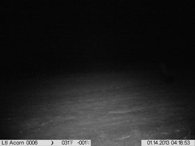 | 0 | night | skunk | empty (0.767) | needs_review | likely_empty |
| 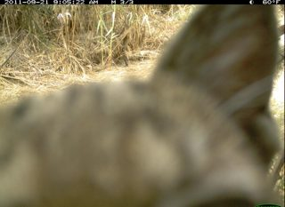 | 46 | day | bobcat | empty (0.694) | needs_review | likely_empty |
| 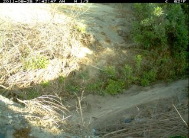 | 40 | day | dog | empty (0.787) | needs_review | likely_empty |
|  | 0 | night | coyote | empty (0.662) | needs_review | likely_empty |
| 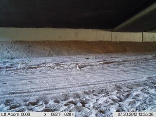 | 0 | day | bird | empty (0.688) | needs_review | likely_empty |
| 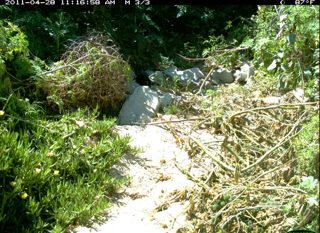 | 100 | day | cat | empty (0.674) | needs_review | likely_empty |
| 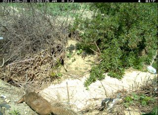 | 40 | day | squirrel | empty (0.715) | needs_review | likely_empty |
| 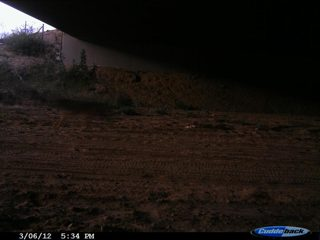 | 0 | day | coyote | empty (0.713) | needs_review | likely_empty |

### Confident wrong species (>= 0.9)

Rule: supported-species event whose suggested species is wrong with confidence >= 0.9. Matching events: 2.

| Frame | Camera | Time | True | Suggested (event conf.) | Released | Rule |
|---|---|---|---|---|---|---|
| 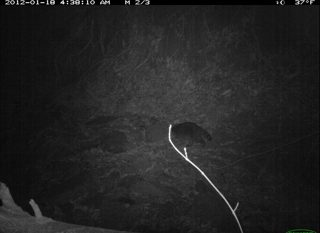 | 78 | night | raccoon | cat (0.902) | needs_review | needs_review |
| 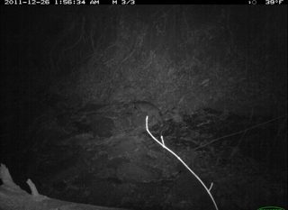 | 78 | night | bobcat | cat (0.907) | needs_review | needs_review |

### Unsupported species suggested as a known one (>= 0.9)

Rule: unsupported-species event suggested as a supported species with confidence >= 0.9. Matching events: 0.

None on the final test.

### Night animal events suggested as empty

Rule: animal event at night whose suggestion is empty (needs review under the released policy). Matching events: 280.

| Frame | Camera | Time | True | Suggested (event conf.) | Released | Rule |
|---|---|---|---|---|---|---|
|  | 0 | night | skunk | empty (0.767) | needs_review | likely_empty |
| 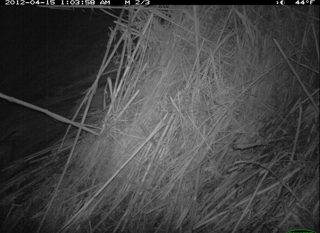 | 28 | night | opossum | empty (0.393) | needs_review | needs_review |
| 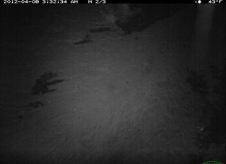 | 28 | night | opossum | empty (0.406) | needs_review | needs_review |
| 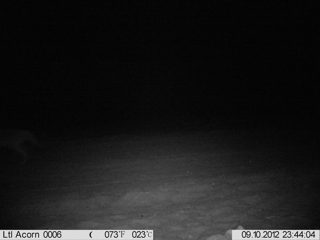 | 0 | night | coyote | empty (0.662) | needs_review | likely_empty |
| 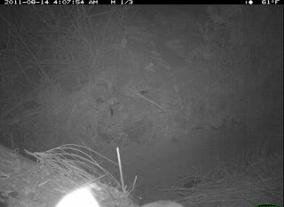 | 40 | night | cat | empty (0.301) | needs_review | needs_review |
| 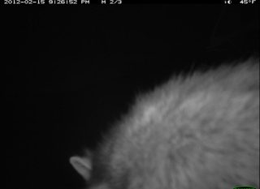 | 46 | night | raccoon | empty (0.351) | needs_review | needs_review |

What the gallery shows: animals that are small, partly hidden in vegetation, or at the frame edge in daylight; dark silhouettes and near-black frames at night; single-frame events, where one ambiguous frame is all the policy has. These are the failure modes listed in the model card; none of them was tuned for.

## Frozen, reproduced, consistent

- **Frozen:** every artifact the plan pins matched its hash (`frozen_artifacts` in [metrics.json](metrics.json)): weights, v2 and v1 policy artifacts, split lock, taxonomy, grouping source, final-test protocol, and the recorded final-test results.
- **Reproduced:** the Stage 10 final test was re-run under its unchanged protocol (15.7 s, cached scores) and gave identical results and identical per-event decisions; the committed record was not rewritten.
- **Consistent:** all 8,982 events were rebuilt with the frozen scoring and policy code, matched the recorded decisions, and the deployed conservative/v2 policy decided every one of them exactly as the v1 policy the final test measured.

## Limitations

- The final test has now been used twice (Stage 10 and here) without any choice made from it. Any change made because of what it shows, such as a per-camera filter, would make it development evidence; a fresh final assessment would need new cameras (for example a consenting owner's deployment).
- Nine cameras is a small sample of deployments; camera-level uncertainty is large.
- Accepted-label precision could not be measured: no species threshold earned automation during development.
- Ground truth is the dataset's annotation; events with an annotated but practically invisible animal count as animal events (see the gallery).

## Reproduce

```bash
uv run wildinbox final-evaluation          # needs the dataset and the trained E3
```

Per-event results (camera, camera-night, role, label, suggestion, confidence, dispositions, audit selection) are in [events.jsonl.gz](events.jsonl.gz), so every number above can be recomputed without the images.
