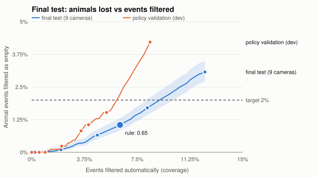
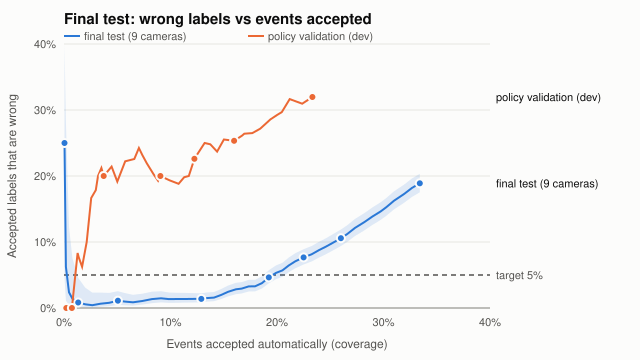

# Final test: unseen cameras

Protocol [`configs/experiments/final_test.yaml`](../../configs/experiments/final_test.yaml) (sha256 `acb50faccc40`), committed before the test was opened. Opened 2026-09-25; every pinned artifact matched its hash. **Measured once: no threshold, model, or rule was chosen or changed on these results.**

23275 images, 8982 capture events, 9 cameras never used for training, calibration, or thresholds (0, 7, 28, 40, 46, 78, 100, 105, 130). Release `finetune-e3-deep-balanced@518a8da39ee0`.

## Against the success targets

| Target (CLAUDE.md) | Result | Status |
|---|---|---|
| Animal-event retention >= 98% | released: 100% (nothing filtered); rule's filter 0.65: 98.95% (95% worst case 98.69%) | met as released; rule's filter met |
| Accepted species precision >= 95%, share auto-labeled reported | 0% of events auto-labeled: acceptance disabled (no threshold earned it) | not applicable |
| Review reduced by 50% (with audits) at the retention target | released: 0.0%; rule's filter: 6.3% (before audits) | **not met** |
| Species quality on unseen cameras | macro-F1 0.447 [0.435, 0.458]; lowest species recall 0.327 | reported |
| Unsupported species wrongly auto-accepted | released: 0 of 233 held-out-species events (acceptance off); at a species threshold of 0.9 it would be 0 | reported |
| 1,000 images within 10 minutes; metadata p95 < 500 ms | 78.5 s; worst p95 138.6 ms (declared hardware) | met |
| Worker restart without lost or duplicate results | real SIGKILL demo passed | met |

## Species classification

|  | Macro-F1 (95% CI) | Lowest species recall | Animal image recall | Images |
|---|---|---|---|---|
| E3 (fine-tuned) | 0.447 [0.435, 0.458] | 0.327 | 86.5% | 20478 |
| Frozen-embedding baseline | 0.285 [0.276, 0.294] | 0.157 | 86.2% | 20478 |

| Class | E3 precision | E3 recall | Baseline recall | Support |
|---|---|---|---|---|
| empty | 0.249 | 0.471 | 0.379 | 1778 |
| bobcat | 0.397 | 0.398 | 0.165 | 2329 |
| cat | 0.287 | 0.327 | 0.157 | 1418 |
| coyote | 0.670 | 0.373 | 0.349 | 2249 |
| dog | 0.495 | 0.636 | 0.550 | 888 |
| opossum | 0.698 | 0.604 | 0.357 | 5504 |
| rabbit | 0.153 | 0.340 | 0.250 | 843 |
| raccoon | 0.755 | 0.570 | 0.316 | 5469 |

E3 confusion (rows = true, columns = predicted):

|  | empty | bobcat | cat | coyote | dog | opossum | rabbit | raccoon |
|---|---|---|---|---|---|---|---|---|
| empty | 838 | 190 | 74 | 29 | 154 | 222 | 250 | 21 |
| bobcat | 322 | 928 | 283 | 54 | 88 | 220 | 306 | 128 |
| cat | 325 | 42 | 464 | 29 | 124 | 130 | 158 | 146 |
| coyote | 403 | 243 | 263 | 840 | 116 | 146 | 162 | 76 |
| dog | 120 | 20 | 68 | 33 | 565 | 0 | 82 | 0 |
| opossum | 576 | 392 | 185 | 36 | 45 | 3326 | 312 | 632 |
| rabbit | 153 | 142 | 70 | 27 | 25 | 131 | 287 | 8 |
| raccoon | 624 | 382 | 210 | 205 | 24 | 589 | 317 | 3118 |

## Random-image vs unseen-camera evaluation

| Model | Seen cameras, held-out sequences | Unseen development cameras | Final test (unseen) |
|---|---|---|---|
| E3 | 0.747 | 0.413 | 0.447 |
| Baseline | 0.724 | 0.258 | 0.285 |

Macro-F1. Evaluating on sequences from the training cameras overstates what a new deployment would see.

## Event decisions

| Policy | Likely empty | Species identified | Needs review |
|---|---|---|---|
| released `conservative/v1+fe20c7586555` | 0 | 0 | 8982 |
| rule `conservative/v1+1dba9bb7ad2b` (filter 0.65) | 564 | 0 | 8418 |

At the rule's filter: 75 of 7154 animal events filtered as empty (1.05% [0.84, 1.31]); 111 of 715 truly empty events filtered.

## Error versus coverage

The development curve (policy validation, where thresholds were chosen) is shown for comparison; the band is the final test's 95% interval.

## Unsupported species

Tuning species set the unfamiliar-score threshold during development; held-out species were never used before this run. All were unseen in fine-tuning; all but deer appear in ImageNet-1k pretraining classes (deer has no final-test events).

| Species | Group | Events | Top predictions (images) | Lost as empty at rule's filter | Accepted as known if threshold 0.5 / 0.7 / 0.9 |
|---|---|---|---|---|---|
| badger | held_out | 8 | empty 5, opossum 4, bobcat 2 | 0 | 2 / 1 / 0 |
| bird | held_out | 80 | empty 127, dog 48, rabbit 16 | 3 | 8 / 0 / 0 |
| fox | held_out | 1 | bobcat 1 | 0 | 1 / 0 / 0 |
| rodent | tuning | 18 | bobcat 24, opossum 9, empty 9 | 0 | 4 / 0 / 0 |
| skunk | held_out | 144 | opossum 143, empty 63, bobcat 46 | 6 | 25 / 5 / 0 |
| squirrel | tuning | 343 | rabbit 393, empty 283, dog 181 | 8 | 64 / 4 / 0 |

Unfamiliar-input detection at the thresholds frozen in development (image level):

| Score | Known animals flagged | Tuning species detected | AUROC | Held-out species detected | AUROC |
|---|---|---|---|---|---|
| distance | 613 / 18700 (3.3% [3.0, 3.5]) | 40 / 1103 (3.6% [2.7, 4.9]) | 0.716 | 23 / 565 (4.1% [2.7, 6.0]) | 0.682 |
| confidence | 541 / 18700 (2.9% [2.7, 3.1]) | 44 / 1103 (4.0% [3.0, 5.3]) | 0.662 | 17 / 565 (3.0% [1.9, 4.8]) | 0.642 |

## Review workload

Grouping alone turns 23275 images into 8982 events (2.59 images per event). Against that grouped workflow, the released policy removes 0.0% of reviews and the rule's filter 6.3%, before any audit sample.

## Cameras, day and night, small animals

| Camera | Images | Macro-F1 | Animal image recall | Animal events | Lost as empty at rule's filter |
|---|---|---|---|---|---|
| 0 | 673 | 0.567 | 85.7% | 705 | 41 (5.8%) |
| 7 | 1805 | 0.480 | 84.7% | 555 | 0 (0.0%) |
| 28 | 1216 | 0.315 | 67.6% | 396 | 6 (1.5%) |
| 40 | 1038 | 0.238 | 92.1% | 282 | 7 (2.5%) |
| 46 | 6011 | 0.332 | 80.9% | 1869 | 14 (0.7%) |
| 78 | 1765 | 0.257 | 93.1% | 725 | 0 (0.0%) |
| 100 | 4494 | 0.459 | 98.0% | 1480 | 2 (0.1%) |
| 105 | 2136 | 0.350 | 74.1% | 693 | 5 (0.7%) |
| 130 | 1340 | 0.290 | 97.5% | 449 | 0 (0.0%) |

Camera spread: macro-F1 0.238 to 0.567 (median 0.332); animal events lost at the rule's filter 0.0% to 5.8%.

| Condition | Images | Macro-F1 | Animal image recall | Lost as empty at rule's filter |
|---|---|---|---|---|
| day | 4922 | 0.409 | 75.0% | 57 / 1989 |
| night | 15556 | 0.366 | 89.4% | 18 / 5165 |

Small animals (largest box < 1% of the frame): 1390 images, species recall 35.8%.

## Provenance

Code `4b2351bbd2f0c1fafcda1b4ada9fdb7b8c886989`; split `cct20-splits-v1-7de740aba75f`; artifacts and hashes in [`opened.json`](opened.json); per-event decisions in [`decisions.jsonl.gz`](decisions.jsonl.gz). Re-running `uv run wildinbox final-test` must reproduce these numbers exactly or it refuses to write.

Released policy: every event goes to review; the `empty` filter and species acceptance stay off.
